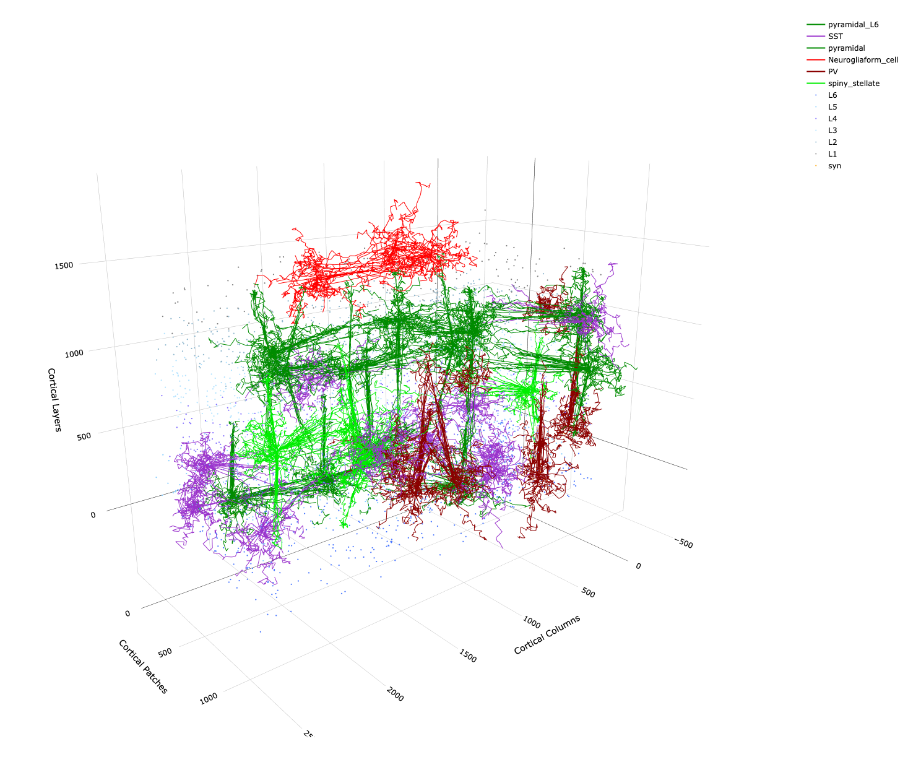

  

# DACx: Digital Auditory Cortex

DACx is an R/C++ package for running biologically realistic simulations of the mammalian auditory cortex -- a "digital twin". [Network topologies](articles/tutorial_network_topology.html) are built from clusters of cells, called *nodes*, arrayed in three dimensions and connected using circuit motifs. [Network activity](articles/tutorial_BGT) is simulated using an expanded version of the growth-transform (GT) membrane voltage time derivative introduced by [Gangopadhyay and Chakrabartty](https://doi.org/10.3389/fnins.2020.00425).

The package is built around several C++ object classes for building networks: 

- cell_type: A struc for specifying cell characteristics related to membrane electrical properties and kinetics, axon transmission speed, synaptic transmission, and axon and dendrite arborization.
- cell_arbors: A struc for efficiently storing and manipulating large branching tree structures representing axonal and dendritic arbors.
- motif: A class for specifying general patterns of connectivity between cells in a circuit, relative to an indexical pre-synaptic home column.
- network: A class for simulating spiking neural networks with GT dynamical systems.

Networks are built using motifs, which ultimately specify a matrix of transconductances (synaptic weights) between cells. The raison d'être of networks is to compute signal transmission lag between cells from their types and arbors and to compute the resulting network state from the GT membrane voltage time derivative $\partial v/\partial t$.

What is the "growth-transform" $\partial v/\partial t$? The net metabolic power $\mathcal{H}$ used by a spiking neural network can be thought of as a cost function and the network itself can be thought of as a mathematical manifold $v$ of membrane voltage values, one per cell. [Gangopadhyay and Chakrabartty](https://doi.org/10.3389/fnins.2020.00425) have shown how to apply the [Baum-Eagon inequality](https://doi.org/10.1090/S0002-9904-1967-11751-8) to $\mathcal{H}$ on $v$ to derive a function $\partial v/\partial t=\sigma:v\rightarrow v$ that is guaranteed to monotonically decrease $\mathcal{H}$ over time. Such a function $\sigma$ is called a *growth transform*. Although this derivation of $\partial v/\partial t$ is purely mathematical without any reference to the biological phenomenon being modeled, the introductory tutorial to [biological growth-transform models](articles/tutorial_BGT) provides a biologically interpreted and motivated derivation. 

  
  
Example plot of 3D network topology producable with DACx.

## Who we are

DACx is a collaboration between [Oviedo Lab](https://oviedolab.org/) (Neuroscience) and the [AIM Lab](https://aimlab.wustl.edu/) (Electrical & Systems Engineering) at Washington University in St. Louis. 

Copyright (C) 2026, Michael Barkasi
barkasi@wustl.edu
