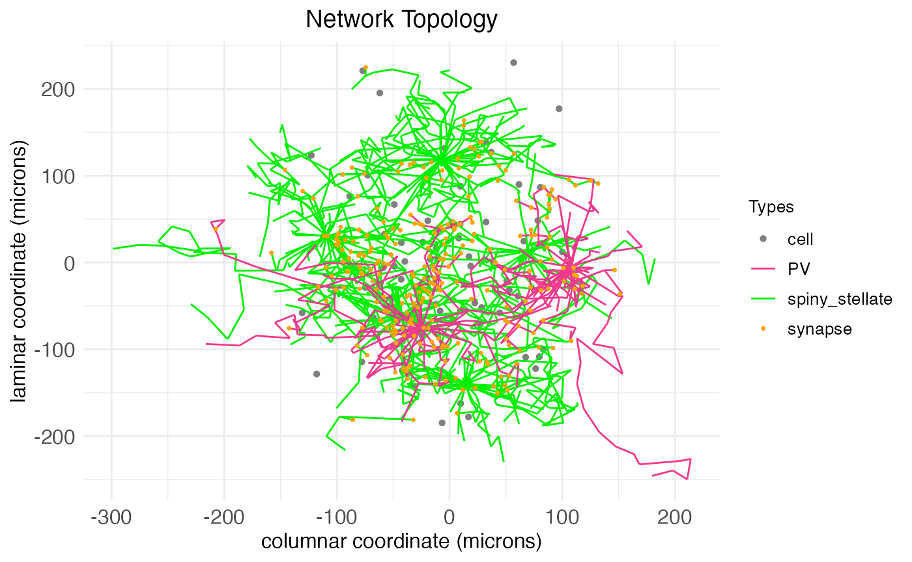
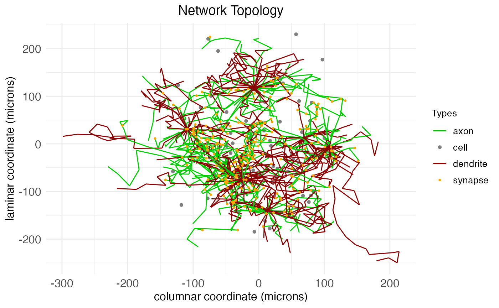
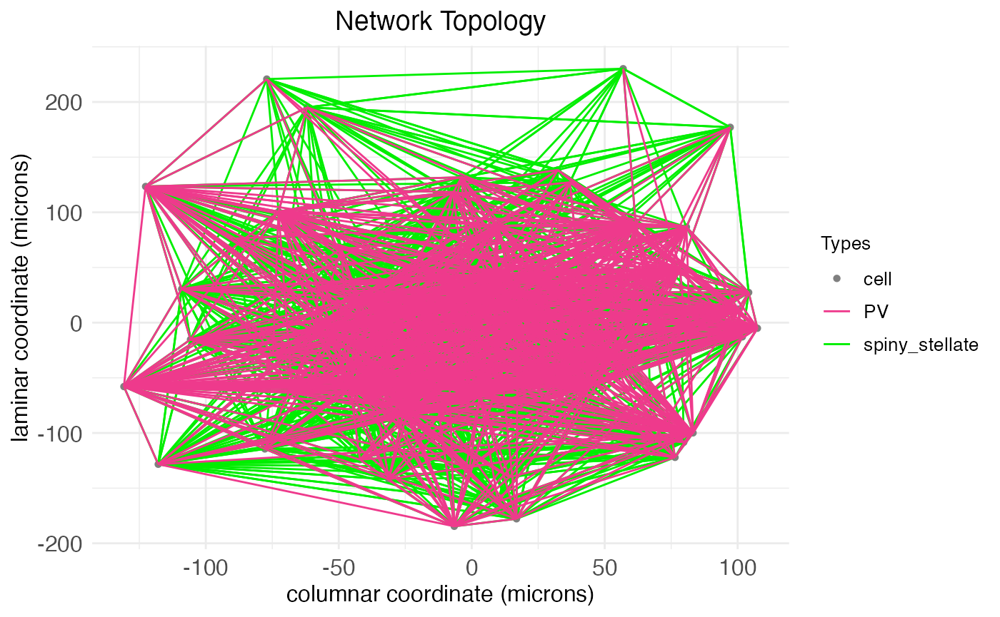
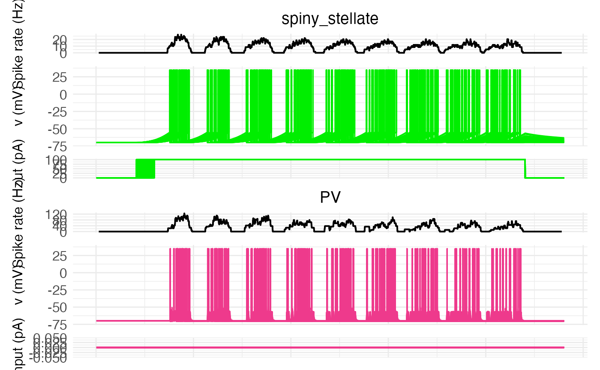
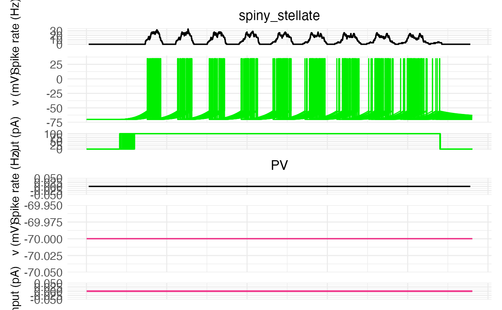

# Spatial growth-transform models

## Introduction

The simplest mathematical models of neural networks are built from
homogeneous McCulloch-Pitts neurons with atemporal, scalar-weight
connections between them. Biological neural networks, such as those in
the mammalian brain, are far more complex. They contain different types
of neurons each with their own electrical behavior and spatiotemporally
extended connections.


A sample neural network diagram from the original [1943
paper](https://link.springer.com/article/10.1007/BF02478259) by
McCulloch and Pitts.

Computational neuroscientists standardly model biological neural
networks as [dynamical systems](https://philpapers.org/rec/ELIMBM-3),
i.e., as having time-dependent states.
[Growth-transform](https://doi.org/10.3389/fnins.2020.00425) (GT)
models, extended to spiking neural networks by Gangopadhyay and
Chakrabartty, are one example. These models treat the change in membrane
potential over time, \partial v/\partial t, as a growth-transform of the
membrane potentials v on the net metabolic power \mathcal{H} of a
network, in the sense that it’s assumed that \partial v/\partial t
satisfies the [Baum-Eagon
inequality](https://doi.org/10.1090/S0002-9904-1967-11751-8):
\mathcal{H}(v)\leq \mathcal{H}(v + \partial v/\partial t) In other
words: \frac{\partial\mathcal{H}}{\partial v}\frac{\partial v}{\partial
t} \leq 0 Thus, GT models are essentially energy-minimization models of
neural dynamics. This is in contrast to models such as Hodgkin-Huxley,
which describe neural dynamics directly in terms of ionic currents.
Despite this apparent disconnect from biology, DACx is based on a
[biological
interpretation](https://Oviedo-Lab.org/DACx/articles/tutorial_math.md)
of the underlying mathematics of GT models.

In practical terms, instead of only a weight between two homogeneous
neurons, GT models use both a cell-type-dependent synaptic conductance
parameter and a cell-type-dependent temporal modulation factor to
determine network behavior. The synaptic conductance parameter is
essentially a traditional connection weight, while the [temporal
modulation
factor](https://Oviedo-Lab.org/DACx/articles/tutorial_membrane_temporal_dynamics.md)
allows for capturing the electrodynamics \partial v/\partial t of
different neuron types at a single spatial point.

The GT models implemented in the DACx package add a third aspect of
biological realism not captured by the original formulation of
Gangopadhyay and Chakrabartty: a transmission velocity parameter for
each neuron type. While the temporal modulation factor controls membrane
voltage over time at a *single* spatial point, the transmission velocity
parameter determines the rate at which changes in membrane voltage
*propagate between neurons*. For this reason, we refer to our GT models
as *spatial GT* (SGT) models.

SGT models thus allow for network topologies that not only capture
connection strengths between neurons, but also the different types of
neurons and their electrodynamics across both time *and space*. A
[separate
tutorial](https://Oviedo-Lab.org/DACx/articles/tutorial_network_topology.md)
demonstrates how to build spatially extended network topologies for
these models from circuit motifs. This tutorial explains SGT models in
more detail.

## Network nodes

Let’s set up the R environment by clearing the workspace, setting a
random-number generator seed, and loading the DACx package.

``` r

# Clear the R workspace to start fresh
rm(list = ls())

# Set seed for reproducibility
set.seed(12345) 

# Load DACx package
library(DACx, quietly = TRUE) 
```

Next, we create a new network object with the new.network function.

``` r

network.node <- new.network()
```

The object initialized by new.network is a single-node network. As we
use the term, a “node” is not necessarily a single neuron, but is rather
a cluster of nearby neurons with local recurrent connections. These
nodes are expected to be (approximately, locally) fully connected, with
cells of each type synapsing into cells of all other types, at least for
nearby cells. For this tutorial, our nodes will include two distinct
neuron types: an excitatory type, loosely based on layer 4 principal
neurons (spiny stellates), and an inhibitory type, loosely based on
parvalbumin (PV) interneurons. We’ll call them “spiny stellate” and “PV”
cells, to indicate that the simulated spiny stellates have a lower
tau_fast than expected, and that the simulated PV cells have a lower
g_leak than expected.

Nodes are defined by their constitutive cell types and node size (i.e.,
expected number of neurons per type). DACx comes with a number of
preloaded cell types and functions for modifying existing cell types and
adding new ones. Details about cell types are discussed in [another
tutorial](https://Oviedo-Lab.org/DACx/articles/tutorial_celltypes.md).
We will use the modify.cell.type function to set up our spiny stellate
and PV cells. We start by explicitly setting all values in a generic
template type, even those that aren’t changed from the defaults for
spiny stellates and PV cells, for later reproducibility.[^1] The details
of these parameters are explained in the tutorial on cell types.

``` r

modify.cell.type(
    "neuron",
    # Membrane kinetics
    tau_fast              = 2.5,   # ms
    tau_slow              = 60.0,  # ms
    tau_Vs                = 100.0, # ms/spike
    dCdr                  = 0.01,  # concentration/spike
    dVdr                  = 0.05,  # concentration/spike
    max_spike_rate        = 0.1,   # spikes/ms
    g_leak                = 5.0,   # nS
    # Intercell transmission
    spike_velocity        = 500,   # micons/ms, = 0.5 m/s
    spine_density         = 0.0,
    axon_target           = "dendrite_shaft",
    # Spiking
    I_spike               = 1e3,   # pA
    dHdv_bound            = 1.05,
    v_spike               = 35,    # mV
    tau_spike             = 1.0,   # ms
    v_threshold           = -55,   # mV
    v_eq                  = list ( # mV
      "spiny stellate" = 0.0,    # Excitatory, so drives postsynaptic cell membrane v up
      "PV"             = -80.0), # Inhibitory, so drives postsynaptic cell membrane v down
    # Membrane characteristics 
    v_rest                = -70,   # mV
    v_bound               = 1.15,
    g_syn                 = list(  # nS
      "spiny stellate" = 0.1,
      "PV"             = 0.1), 
    tau_syn               = list(  # ms
      "spiny stellate" = 2.0,   # Excitatory glutamate channels close quickly
      "PV"             = 6.0),  # Inhibitory GABA channels stay open longer
    # Neurite structure 
    axon_branch_count     = 20, 
    dendrite_branch_count = 20, 
    branch_independence   = 0.75, 
    branch_spread         = 0.75, 
    apical_target_layer   = "none"
  )
```

For now, it suffices to note that PV interneurons are highly responsive
cells with a high rate of fire, little adaptation (i.e., little
short-term depression), but also little memory – that is, they have a
high leak current and don’t integrate signals. Thus, they function as
coincidence detectors (integrating only near-simultaneous input spikes)
and send strong inhibitory signals. We will keep that character, except
for giving them a lower leak conductance to improve their memory.

``` r

modify.cell.type(
    "neuron", 
    "PV",
    # Membrane kinetics
    tau_fast       = 1.0,   # ms, Short for fast responses
    tau_Vs         = 2.5,   # ms/spike, Fast recovery for little adaptation
    dVdr           = 0.025, # concentration/spike, Low vesicle rate for fast spiking
    max_spike_rate = 0.5,   # spikes/ms, High max spike rate
    g_leak         = 10.0,  # nS, Hight leak conductance for fast kinetics
    # Spiking
    I_spike        = 2e3,   # pA, High-current spikes
    tau_spike      = 0.3,   # ms, Short-duration spikes
    v_threshold    = -50,   # mV, Slightly higher threshold
    spine_density  = 0.0, 
    axon_target    = "soma",
    # Set synaptic weights  
    g_syn          = list(  # nS
      "spiny stellate" = 2.0,
      "PV"             = 1.0)
  )
```

Conversely, spiny stellate cells are slower to respond, have higher
adaptation, but more memory. They serve as signal integrators,
integrating input spikes over longer time stretches. We keep that
character, except for lowering their fast-current time constant
(tau_fast) to make them more responsive.

``` r

modify.cell.type(
    "neuron", 
    "spiny stellate",
    # Membrane kinetics 
    tau_fast       = 5.0,   # ms, Long for slow responses responses
    g_leak         = 1.0,   # nS, Low conductance for slow kinetics 
    # Intercell transmission 
    spike_velocity = 100,   # microns/ms, slower transmission than PV cells
    spine_density  = 0.5, 
    axon_target    = "spine",
    # Membrane characteristics 
    g_syn          = list(  # nS
      "spiny stellate" = 0.4,
      "PV"             = 4.0)
  )
```

Notice that defining the cell types involves setting a g_syn, taking a
list which each cell type as a named entry. This conductance gives the
conductance (in nS) of the cell type’s synapses, for each pre-synaptic
cell type. So, the above settings imply that PV connections onto spiny
stellates are much stronger than connections from other spiny stellates,
while spiny stellates have much stronger projections onto PV cells than
PV cells have onto other PV cells. These values are not strictly
faithful to the actual biology, but will be suitable for modeling a
simple excitatory-inhibitory feedback system.

Mimicking the structure of the brain, nodes are arrayed into layers and
columns, cortical and subcortical regions, and hemispheres. The
[network-topology
tutorial](https://Oviedo-Lab.org/DACx/articles/tutorial_network_topology.md)
explains how to set up this multi-node structure. For now, it suffices
to note that this structure is set with the set.network.structure
function. We will set up a single-node network, with an expected count
of 50 for the spiny stellates and 5 for the PV interneurons.

``` r

n_ss <- 50
n_PV <- 5
sn   <- 20
network.node <- set.network.structure(
    network.node,
    neuron_types          = c("spiny stellate", "PV"),
    neurons_per_node      = c(n_ss, n_PV),
    synaptic_neighborhood = sn # microns
  )
```

By default, the set.network.structure function creates no subcortical
layers and sets the number of cortical layers, columns, patches (a
secondary columnar axis perpendicular to the laminar axis), and
hemispheres each to one. That is, it makes a single node. It also
initializes local recurrent connections within that node. The node we
just created can be visualized with the plot.network function. To keep
the plot clean, we can use the arbor_density argument, which controls
the proportion of cells for which the generated arbors are shown.

``` r

plt <- plot.network(network.node, arbor_density = 0.1)
plt$plot
```



The arbors are generated via a biased random walk, the biasing factors
fixed by cell type. The arbors include both axons and dendrites, which
can be visualized explicitly by changing the arbor coloring. Although
cells and arbors to-be-plotted are selected randomly, the plot.network
function returns masks for the cells and arbors plotted, and can take
this information to re-plot the same data again under different
settings, e.g., coloring by arbor type instead of by cell type:

``` r

plt <- plot.network(
    network.node, 
    arbor_density = 0.1,
    soma_mask     = plt$soma_mask,
    arbor_idx     = plt$arbor_idx,
    edge_color    = "is_axon"
  )
plt$plot
```



The existence and number of connections between cells – synapses,
colored orange – are determined by the proximity of axons to dendrites.
After the arbors are created, a separate algorithm looks for axon nodes
within a certain small neighborhood (set by synaptic_neighborhood) of
dendrite nodes and, if one is found, extends the axon to connect with
the dendrite.

As the axis labels indicate, SGT models assign to each neuron a spatial
coordinate giving its location along the laminar, columnar, and patch
axes. All coordinates are continuous and real-valued and are used in
conjunction with the transmission velocity parameter to simulate spike
propagation over the axonal arbors. While the above are 2D plots (which
drop the patch axis), we can plot a 3D representation of our node,
colored by cell type:

``` r

plt <- plot.network(
    network.node, 
    arbor_density = 1.0,
    soma_mask     = plt$soma_mask,
    arbor_idx     = plt$arbor_idx,
    threedim      = TRUE
  )
plt$plot
```

As can be seen, even for a small single node, the arborization and
number of synapses can be extensive. We can quantify the extent by
calling the fetch.network.components function, which returns a list of
all components of the network, including a print out of summary data:

``` r

ntw <- fetch.network.components(network.node, include_arbors = TRUE)
```

``` scroll-output
## Summary of network:
##  Number of neurons: 55 
##  Number of synapses: 1655 
##  Hemisphere names: left 
##  Number of hemispheres: 1 
##  Subortical layer names:  
##  Number of subcortical layers: 0 
##  Cortical layer names: layer 
##  Number of cortical layers: 1 
##  Number of columns: 1 
##  Number of patches: 1 
##  Cell types used: spiny stellate, PV 
##  Motifs used: local connections
```

All of the above plots show the spatially extended arbors which produce
synaptic connections between cells. If we want to visualize just the
*connections* without the mess of the arbors, we can do so by setting
reconstruct_arbors to FALSE. This represents connections between cells
in the familiar form of straight edges. By plotting all arbors, we see
that our network is more-or-less fully connected.

``` r

plot.network(
    network.node, 
    arbor_density      = 1.0,
    reconstruct_arbors = FALSE
  )$plot
```



As the axis labels in the previous plots indicate, there is a physically
meaningful unit attached to the dimensions: microns. The formulas used
to compute spatial coordinates are discussed in the [network-topology
tutorial](https://Oviedo-Lab.org/DACx/articles/tutorial_network_topology.md).

## SGT simulations

The function run.SGT runs a simulation of spiking activity across a
network using a SGT model. The function is just a wrapper over the SGT
method of C++ network objects. It takes four arguments:

1.  network: A network created by the new.network function and
    structured by the set.network.structure function.
2.  I_stim: A matrix of input currents (in pA) over the duration of the
    simulation, rows representing neurons and columns representing time
    bins.
3.  dt: Time-step size for simulation, in ms. Default is 10^{-3}.
4.  initial_potential: Initial value for membrane potential, applied to
    all cells. Default is -70 mV, and this means that if any cell types
    in the network have a rest potential above -70 mV, this value must
    be changed.

The number of columns of I_stim determines the length of the simulation.
In essence, the function run.SGT answers the question: How would the
network respond to this stimulus current over this amount of time?

For example, let’s run a 1,200 ms simulation for the node we created
above. From the above call to fetch.network.components, we know there
are 71 neurons in our network. We can load this value directly from the
function output:

``` r

n_neurons <- ntw$n_neurons
```

This gives us the number of rows needed in our stimulus current matrix.
For the number of columns, we need to know the number of time steps
required:

``` r

stim_time_ms <- 1200
dt           <- 1e-3
n_steps      <- stim_time_ms/dt
cat("Number of time steps in the simulation:", n_steps)
```

``` scroll-output
## Number of time steps in the simulation: 1200000
```

Now, suppose we want our simulation to have a 1000 ms input current to
just the spiny stellates, starting at 100 ms. We can compute the initial
and final time steps of this current, plus a mask for the spiny
stellates, as follows:

``` r

# Set stimulus start and length
stim_length_ms      <- 1000
stim_start_ms       <- 100
# Find start and end steps of the input stimulus current
stim_length         <- stim_length_ms / dt
stim_start          <- stim_start_ms / dt 
stim_end            <- stim_start + stim_length - 1
# Find mask for principal neurons
spiny_stellate_mask <- ntw$neuron_type_name == "spiny stellate"
```

A final question is how much current to apply. For this simulation,
we’ll use a constant current of 100 pA to the spiny stellates during the
stimulus period. As cell responses are fully deterministic, we will also
feather the onset of this stimulus current, so that the initial spikes
come at slightly different times.

``` r

I_stim <- matrix(0, nrow = n_neurons, ncol = n_steps)
I_stim[spiny_stellate_mask, stim_start:stim_end] <- 100
for (i in which(spiny_stellate_mask)) {
    I_stim[i, stim_start:(stim_start + sample.int(50/dt, 1))] <- 0
  }
```

With the stimulus current matrix in hand, we can run the simulation:

``` r

sim_results <- run.SGT(
    network.node,
    I_stim,
    dt
  )
```

The result of the function run.SGT is a matrix of spike traces formatted
similar to I_stim: each row represents a neuron and each column
represents a time step from the simulation. Each entry is the membrane
potential of the neuron at that time bin, in mV. The order of neurons
and time steps matches across the input stimulus-current and output
spike-trace matrices, of course. In addition, a vector of spike counts
for each neuron (giving the number of times each neuron spiked) in the
network is also returned. Both are returned in a list of two elements,
sim_traces and spike_counts.

The neurons package also includes the function plot.network.traces,
which takes a network object with a trace matrix and produces a plot of
the traces, putting all neurons of the same type together.

``` r

plot.network.traces(network.node, I_stim = I_stim, return_plot = TRUE)
```

    ## Warning: Removed 172 rows containing missing values or values outside the scale range (`geom_line()`).
    ## Removed 172 rows containing missing values or values outside the scale range (`geom_line()`).



``` r

plt <- plot.network(
    network.node, 
    arbor_density = 1.0,
    threedim      = TRUE
  )
plt$plot
```

At first glance, we see a rhythmic firing of the excitatory spiny
stellates of about 4 Hz (i.e., theta waves, as in deep sleep). We see a
matching rhythmic pattern for the PV cells. This is a classic
excitatory-inhibitory feedback loop, wherein the excitatory cells drive
the stimulus-free inhibitory cells to fire, the inhibitory firing
silences the excitatory cells, which silences the inhibitory cells,
allowing the stimulus current to the excitatory cells to drive them
again, producing a new round of firing.

One way to see this dynamic is to rerun the simulation, first with no
input into the PV cells, then with input into the PV cells, but no
feedback onto the spiny stellates. Cell type information is saved across
the session, so, we only need to modify the relevant part of the PV
cells (the strength of the synapses from spiny stellates).

``` r

set.seed(12345) 
network.node_disconnectedPV <- new.network()

# Disconnect PVs from spiny stellates
modify.cell.type(
    "PV",
    g_syn = list("spiny stellate" = 0.0)
  )

# Set network
network.node_disconnectedPV <- set.network.structure(
    network.node_disconnectedPV,
    neuron_types          = c("spiny stellate", "PV"),
    neurons_per_node      = c(n_ss, n_PV),
    synaptic_neighborhood = sn # microns
  )

# Rerun with PVs disconnected 
sim_results_disconnectedPV <- run.SGT(
    network.node_disconnectedPV,
    I_stim,
    dt
  )

# Plot traces
plot.network.traces(network.node_disconnectedPV, I_stim = I_stim)
```

    ## Warning: Removed 164 rows containing missing values or values outside the scale range (`geom_line()`).
    ## Removed 164 rows containing missing values or values outside the scale range (`geom_line()`).



As can be seen, without spike input from the spiny stellates, the PV
cells show no activity. Note, also, that without the inhibitory feedback
from the PV cells, the spiny stellate population has lost its rhythmic
firing. As there is a constant stimulus driving the cells, the
population as a whole shows a constant firing.

Thus, the rhythmic firing pattern of the original network requires the
excitatory-inhibitory feedback loop.

## Spatial lag

What about I\_\mathrm{synaptic\\transmission}, the input current induced
by synaptic transmission across all synapses? We assume that the induced
post-synaptic current is equal to the inducing pre-synaptic potential,
modulated by the synaptic conduction. However, the complicating factor
is that, given spatial distance between cells and synaptic transmission
time, the relevant pre-synaptic potential v at time t from pre-synaptic
neuron N may not be v(t), but rather v(t^\prime) for some t^\prime \< t.

Let \vec{v} = \langle v_1, v_2, \ldots, v_n\rangle be the vector of
membrane potentials for all n neurons in the network at time t. Further,
let V be a n\times n time-dependent matrix which captures how each
neuron “sees” the others. Specifically, V\_{ij}(t) is the membrane
potential of neuron N_i that reaches neuron N_j at time t. Then,
assuming Q is an n\times n matrix of synaptic connections such that
Q\_{ij} is the conductance from neuron j to neuron i, we have that:
I\_\mathrm{synaptic\\transmission}(N_i) = \sum\_{j=1}^n
Q\_{ij}V\_{ji}(t)

[^1]: As of August 89, 2026, all cell-type parameter defaults are
    tentative and under development, and so likely to change.
