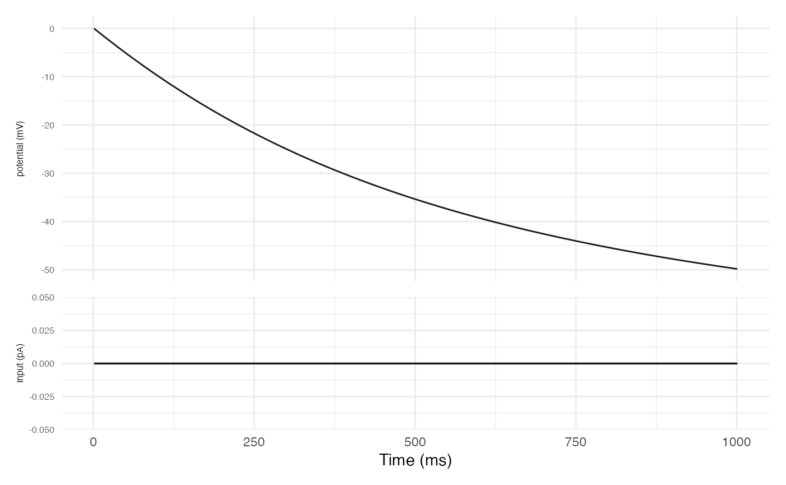
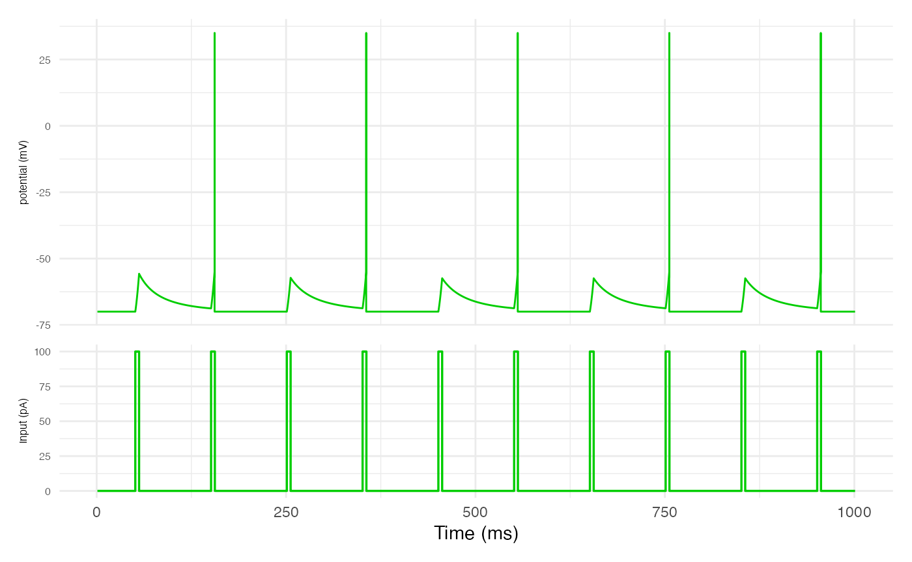
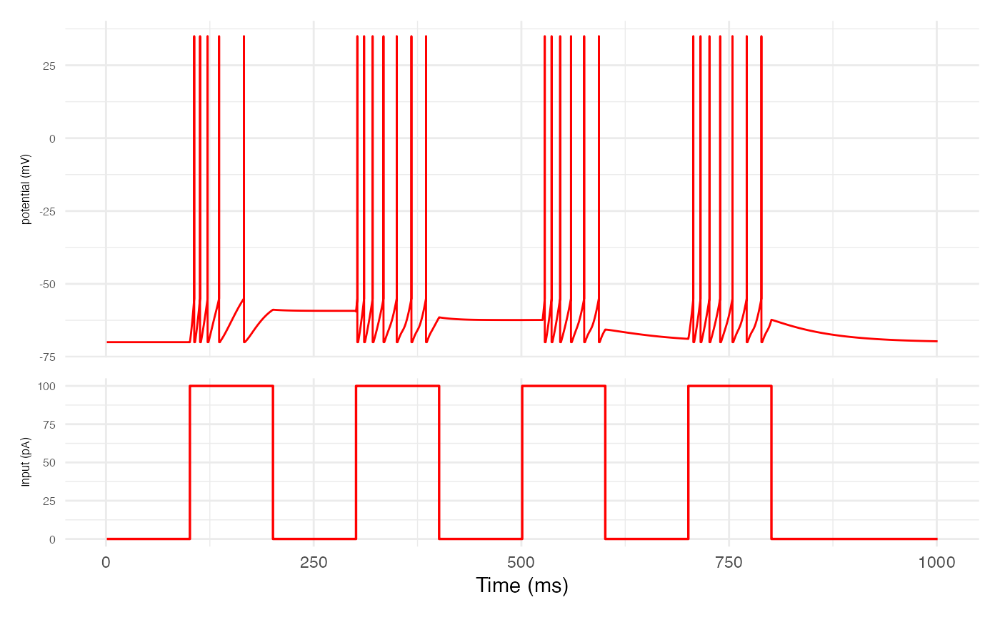
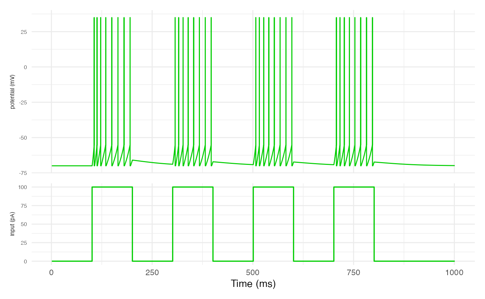
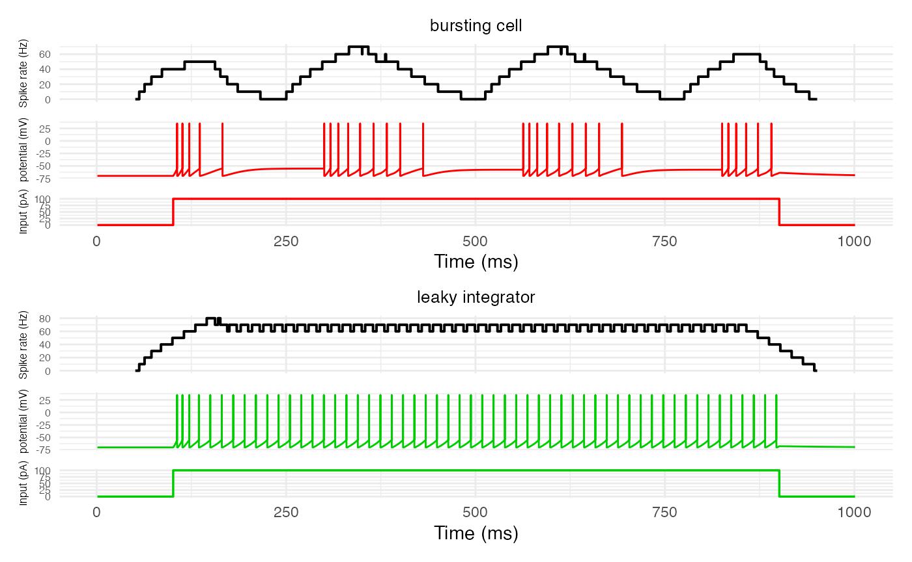

# Single-cell temporal dynamics

## Introduction

## Single-cell network

Let’s set up the R environment by clearing the workspace, setting a
random-number generator seed, and loading the DACx package.

``` r

# Clear the R workspace to start fresh
rm(list = ls())

# Set seed for reproducibility
set.seed(12345) 

# Load DACx package
library(DACx, quietly = TRUE) 
```

Next, we create a new network object with the new.network function.

``` r

nonspiking_cell <- new.network()
```

Set up cell

The parameters defining cell types in DACx are mostly biophysically
interpretable and can be set with, or tested against, experimental data.

#### Parameters for transmitter type

- *Valence:* 1 for excitatory cells, -1 for inhibitory cells. Code
  variable: valence.

#### Temporal modulation parameters

The temporal modulation term T controlling the responsiveness (size) of
\partial v/\partial t is determined by an exponential decay function
with parameters:

- *Temporal modulation bias:* The baseline value b of T, in ms. Code
  variable: temporal_modulation_bias.
- *Temporal modulation time constant:* The time constant \tau of the
  exponential decay in T, in ms. Code variable:
  temporal_modulation_timeconstant.
- *Temporal modulation amplitude:* The amplitude A of the exponential
  decay in T, in ms. Code variable: temporal_modulation_amplitude. A
  value \>0 induces bursting behavior, while a value of zero induces
  tonic (rhythmic) firing.

Development note: The values of these parameters are 1/0.0001 times the
intended values in ms, due to debugging.

#### Intercell transmission parameters

- *Transmission velocity:* The speed of the action potential between
  neurons, in microns/ms. Code variable: transmission_velocity.
- *Spine density:* The proportion (a value between 0 and 1) of dendrite
  nodes expected to be spines. Code variable: spine_density.
- *Axon target:* The kind of nodes onto which the cell’s axons can
  synapse. Possible values include “spine”, “dendrite_shaft”, “soma”,
  and “axon_shaft”. Code variable axon_target.

#### Membrane parameters

- *Potential bound:* The maximum absolute value v\_\mathrm{bound} of
  potential difference in electrical charge between the inside and
  outside of the cell, in mV. Code variable v_bound. Theoretically, we
  assume this is the absolute value of the rest voltage, plus a little
  bit. What matters is that -v\_\mathrm{bound} \leq v \leq
  v\_\mathrm{bound} for all possible membrane potentials v. For example,
  75mV is a reasonable value.
- *Metabolic energy derivative bound:* Bound \partial I\_\mathrm{influx}
  on the absolute value of the derivative \partial\mathcal{H}/\partial v
  of metabolic energy \mathcal{H} with respect to potential v, such that
  \partial I\_\mathrm{influx} \geq \|\partial\mathcal{H}/\partial v\|,
  in mA. Code variable: dHdv_bound. Theoretically, we assume that this
  value is approximately the change in current when v crosses the spike
  threshold, which we assume is approximately the spike current. In
  practice, we add 5%.
- *Spike current:* The current of the action potential, i.e., the total
  current crossing the membrane over the entire area of the cell during
  a spike, in mA. Code variable: I_spike. As a starting point, we assume
  this is 10^{-3}mA, i.e., one mico amp.
- *Spike potential:* The value v\_\mathrm{spike} of an action potential,
  in mV. Code variable: spike_potential. The default is 35mV.
- *Resting potential:* The potential difference v\_\mathrm{rest} in
  electrical charge between the inside and outside of the cell at rest,
  in mV. Code variable: resting_potential. The default is -70mV.
- *Threshold:* The potential difference v\_\mathrm{threshold} in
  electrical charge between the inside and outside of the cell at which
  an action potential is triggered, in mV. Code variable: threshold. The
  default is -55mV.

#### Parameters for process size and structure

- *Axon branch count:* An integer value giving the expected number of
  nodes per branch in the axon arbor. Code variable: axon_branch_count.
- *Dendrite branch count:* Same as axon branch count, but for dendrites.
  Code variable: dendrite_branch_count.
- *Branch independence:* The expected proportion (a value between 0 and
  1) of branches which connect directly to the soma, with 1 meaning all
  branches connect directly to the soma and zero meaning that all
  branches connect to the soma from a single segment. Code variable:
  branch_independence.
- *Branch spread:* Scaled value between 0 and 1 controlling the tendency
  of arbor branches to repel away from the soma with 1 meaning a
  straight line away from the soma and 0 meaning no bias with respect to
  soma position. Code variable: branch_spread.

#### Apical dendrite parameters

- *Apical target layer:* Character string giving the name of the layer
  to which apical dendrite is expected to grow, if any; if none, “none”.
  Intended for modeling the circuit topology of pyramidal neurons. Code
  variable: apical_target_layer.

``` r

# The formula is: = v_traces.col(t - 1) + (STD_W.array() * dvdt.array() / tau.array()).matrix();
# So, the temporal modulation factor T is really STD_W/tau, where tau is a fast-response adaptation (e.g., for bursting) dependent on only time since last spike, and STD_W is a mesoscale adaptation ("short-term depression") dependent on some back-looking window of spikes.
# T(t) models ion channel kinetics (from ChatGPT): "T(t) is analogous to an effective membrane time-scale or effective membrane resistance in that it modulates the rate of voltage evolution without altering the underlying energy landscape."


modify.cell.type(
    "neuron", 
    "subthreshold only",
    g_leak      = 0.1,   # nS, Slow leak for demonstration purposes
    v_threshold = 1000   # Something large, to suppress spiking
  )

nonspiking_cell <- set.network.structure(
    nonspiking_cell, 
    neuron_types     = c("subthreshold only"), 
    neurons_per_node = 1
  )
```

## BGT simulations

This gives us the number of rows needed in our stimulus current matrix.
For the number of columns, we need to know the number of time steps
required:

``` r

stim_time_ms <- 1000
dt           <- 1e-3
n_steps      <- stim_time_ms/dt
cat("Number of time steps in the simulation:", n_steps)
```

``` scroll-output
## Number of time steps in the simulation: 1e+06
```

Now, suppose we want our simulation to involve a 20ms input current to
just the spiny stellates, starting at 10ms. We can compute the initial
and final time steps of this current, plus a mask for the spiny
stellates, as follows:

A final question is how much current to apply. For this simulation,
we’ll use a constant current of 100 pico amp (100\times 10^{-9}mA) to
the spiny stellates during the stimulus period. It might be natural to
leave the input current at zero outside of the stimulus period, but
there is endogenous background activity even without exogenous input to
the network. So, we’ll specify a baseline input current of 10 pico amps
(10\times 10^{-9}mA) to all neurons throughout the entire stimulation
period:

``` r

stim_magnitude <- 100
no_stim  <- matrix(0, nrow = 1, ncol = n_steps)
```

With the stimulus current matrix in hand, we can run the simulation:

``` r

nonspiking_cell_results <- run.BGT(
    nonspiking_cell,
    no_stim,
    dt,
    v_initial = 0.0
  )
plot.network.traces(nonspiking_cell, I_stim = no_stim, plot_rates = FALSE)
```



``` r

integrating_cell <- new.network()
modify.cell.type(
    "neuron",
    "leaky integrator", 
    # Membrane kinetics
    tau_fast              = 1.0,   # ms
    tau_slow              = 60.0,  # ms
    tau_Vs                = 100.0, # ms/spike
    dCdr                  = 0.01,  # concentration/spike
    dVdr                  = 0.05,  # concentration/spike
    max_spike_rate        = 0.1,   # spikes/ms
    g_leak                = 1.0,   # nS
    # Intercell transmission
    spike_velocity        = 500,   # micons/ms, = 0.5 m/s
    spine_density         = 0.0,
    axon_target           = "dendrite_shaft",
    # Spiking
    I_spike               = 1e3,   # pA
    dHdv_bound            = 1.05,
    v_spike               = 35,    # mV
    tau_spike             = 1.0,   # ms
    v_threshold           = -55,   # mV
    v_eq                  = list ( # mV
      "spiny stellate" = 0.0,    # Excitatory, so drives postsynaptic cell membrane v up
      "PV"             = -80.0), # Inhibitory, so drives postsynaptic cell membrane v down
    # Membrane characteristics 
    v_rest                = -70,   # mV
    v_bound               = 1.15,
    g_syn                 = list(  # nS
      "spiny stellate" = 0.1,
      "PV"             = 0.1), 
    tau_syn               = list(  # ms
      "spiny stellate" = 2.0,   # Excitatory glutamate channels close quickly
      "PV"             = 6.0),  # Inhibitory GABA channels stay open longer
    # Neurite structure 
    axon_branch_count     = 20, 
    dendrite_branch_count = 20, 
    branch_independence   = 0.75, 
    branch_spread         = 0.75, 
    apical_target_layer   = "none"
  )


integrating_cell <- set.network.structure(
    integrating_cell, 
    neuron_types     = c("leaky integrator"), 
    neurons_per_node = 1
  )
```

``` r

# Set stimulus start and length
stim_length_ms <- 5
stim_start_ms  <- seq(from = 50, to = 950, by = 100)
# Find start and end steps of the input stimulus current
stim_length    <- stim_length_ms / dt
stim_start     <- stim_start_ms / dt
stim_end       <- stim_start + stim_length - 1
short_stims    <- no_stim
for (i in seq_along(stim_start)) {
  short_stims[, stim_start[i]:stim_end[i]] <- stim_magnitude
}
```

``` r

integrating_cell_results <- run.BGT(
  integrating_cell,
  short_stims,
  dt,
  v_initial = -70
)
plot.network.traces(integrating_cell, I_stim = short_stims, plot_rates = FALSE)
```



``` r

bursting_cell <- new.network()
modify.cell.type(
    "leaky integrator", 
    "bursting cell",
    dCdr = 0.05, # up from 0.01, to induce bursting
  )

bursting_cell <- set.network.structure(
    bursting_cell, 
    neuron_types = c("bursting cell"), 
    neurons_per_node = 1
  )
```

``` r

# Set stimulus start and length
stim_length_ms <- 100
stim_start_ms  <- seq(from = 100, to = 750, by = 200)
# Find start and end steps of the input stimulus current
stim_length    <- stim_length_ms / dt
stim_start     <- stim_start_ms / dt
stim_end       <- stim_start + stim_length - 1
long_stims     <- no_stim
for (i in seq_along(stim_start)) {
  long_stims[, stim_start[i]:stim_end[i]] <- stim_magnitude
}
```

``` r

bursting_cell_results <- run.BGT(
  bursting_cell,
  long_stims,
  dt,
  v_initial = -70
)
plot.network.traces(bursting_cell, I_stim = long_stims, plot_rates = FALSE)
```



``` r

integrating_cell_results <- run.BGT(
  integrating_cell,
  long_stims,
  dt,
  v_initial = -70
)
plot.network.traces(integrating_cell, I_stim = long_stims, plot_rates = FALSE)
```



``` r

# Set stimulus start and length
stim_length_ms  <- 800
stim_start_ms   <- 100
# Find start and end steps of the input stimulus current
stim_length     <- stim_length_ms / dt
stim_start      <- stim_start_ms / dt
stim_end        <- stim_start + stim_length - 1
continuous_stim <- no_stim
for (i in seq_along(stim_start)) {
  continuous_stim[, stim_start[i]:stim_end[i]] <- stim_magnitude
}
```

``` r

network_both <- new.network()
network_both <- set.network.structure(
    network_both, 
    neuron_types = c("bursting cell", "leaky integrator"), 
    neurons_per_node = 1
  )
no_stim2  <- matrix(0, nrow = 2, ncol = n_steps)
continuous_stim2 <- no_stim2
for (i in seq_along(stim_start)) {
  continuous_stim2[, stim_start[i]:stim_end[i]] <- stim_magnitude
}
network_both_long <- run.BGT(
  network_both,
  continuous_stim2,
  dt,
  v_initial = -70
)
plot.network.traces(
  network_both, 
  I_stim = continuous_stim2, 
  plot_rates   = TRUE, 
  window_size  = 0.1,
  return_plot  = TRUE
  )
```

    ## Warning: Removed 49996 rows containing missing values or values outside the scale range (`geom_line()`).
    ## Removed 49996 rows containing missing values or values outside the scale range (`geom_line()`).



``` r

modify.cell.type(
    "leaky integrator",
    "slow recovery",
    tau_Vs = 500.0 # up from 100.0
  )
modify.cell.type(
    "leaky integrator", 
    "slow drain",
    dVdr = 0.01 # down from 0.05
  )
network_both <- new.network()
network_both <- set.network.structure(
    network_both, 
    neuron_types = c("leaky integrator", "slow recovery", "slow drain"), 
    neurons_per_node = 1
  )

# Set stimulus start and length
stim_length_ms  <- 1200
stim_start_ms   <- 100
# Find start and end steps of the input stimulus current
stim_length     <- stim_length_ms / dt
stim_start      <- stim_start_ms / dt
stim_end        <- stim_start + stim_length - 1
no_stim2          <- matrix(0, nrow = 3, ncol = stim_end + (100/dt))
continuous_stim2  <- no_stim2
recover_start_ms  <- c(200, 500)
recover_length_ms <- c(100, 500)
recover_start     <- recover_start_ms / dt
recover_length    <- recover_length_ms / dt
recover_end       <- recover_start + recover_length - 1
for (i in seq_along(stim_start)) {
  continuous_stim2[, stim_start[i]:stim_end[i]] <- stim_magnitude
}
for (i in seq_along(recover_start)) {
  continuous_stim2[, recover_start[i]:recover_end[i]] <- 0
}
network_both_long <- run.BGT(
  network_both,
  continuous_stim2,
  dt,
  v_initial = -70
)
plt <- plot.network.traces(network_both, I_stim = continuous_stim2, plot_rates = TRUE, window_size = 0.05, return_plot = TRUE)
plt <- plt & ggplot2::theme(
            plot.title       = ggplot2::element_text(hjust = 0.5, size = 14),
            axis.title.y     = ggplot2::element_text(size = 10),
            axis.text.y      = ggplot2::element_text(size = 8)
          ) 
for (p in c(1:3)) {
  plt[[p]][[1]] <- plt[[p]][[1]] + ggplot2::coord_cartesian(ylim = c(0, 120)) +
  ggplot2::geom_hline(
    yintercept = 75,
    color = "red",
    linetype = "dashed"
  )
}
```

## Temporal modulation

The final step in GT models (including BGT models) is to divide the rate
of change for membrane potential \partial v/\partial t by a temporal
modulation term T, such that: v(t+1) = v(t) + \frac{\left.\frac{\partial
v}{\partial t}\right\|\_{t+1}}{T} This term T is given by the following
exponential decay model: T = b + A\exp\left(-\frac{x}{\tau}\right) where
b is the temporal modulation bias, A is the temporal modulation
amplitude, and \tau is the temporal modulation time constant. The
traditional input x is filled by B, a “burst” step counter. The step
counter B is merely a numerical device in the simulation to carry T
repeatedly across the exponential decay via the input x. When T\<b, B
resets to zero (and thus T jumps again to a high number), resetting the
exponential decay.

When the amplitude A is zero, the exponential decay has no effect and
all that’s relevant is the bias b. When A\>0, the effect is to increase
T at the start of the step counter, thereby shrinking the effect of
\partial v/\partial t. This shrinkage follows the exponential decay of
T, so that there is little chance in v (i.e., small \partial v/\partial
t) at the start of the step counter, but the possibility for large
changes in v at the end of the step counter. Thus, when at the end of
the step counter, neurons are prone to many spikes as their membrane
potential rapidly changes, creating a bursting effect.
