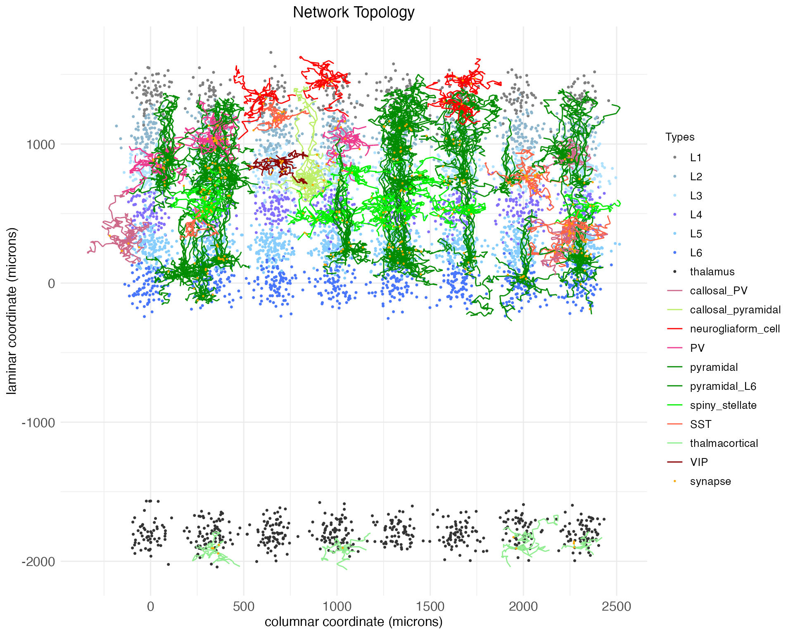
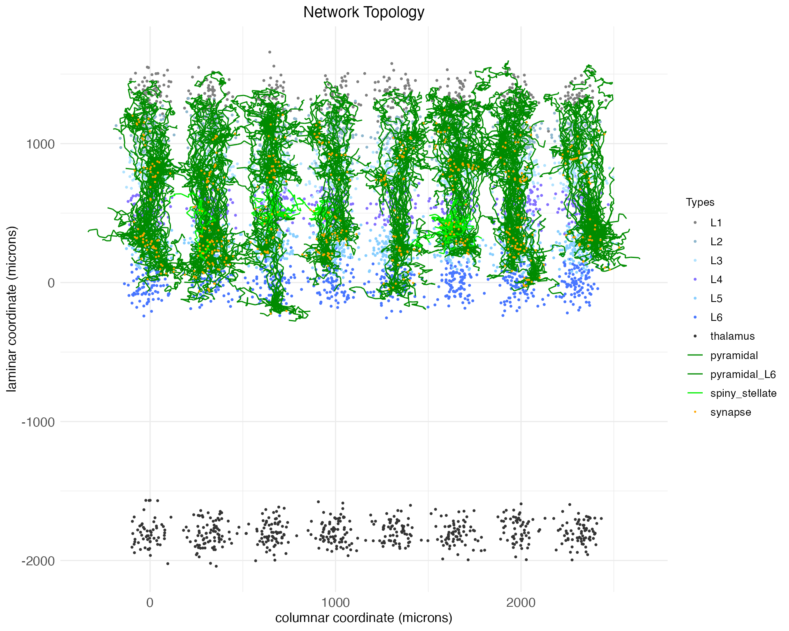
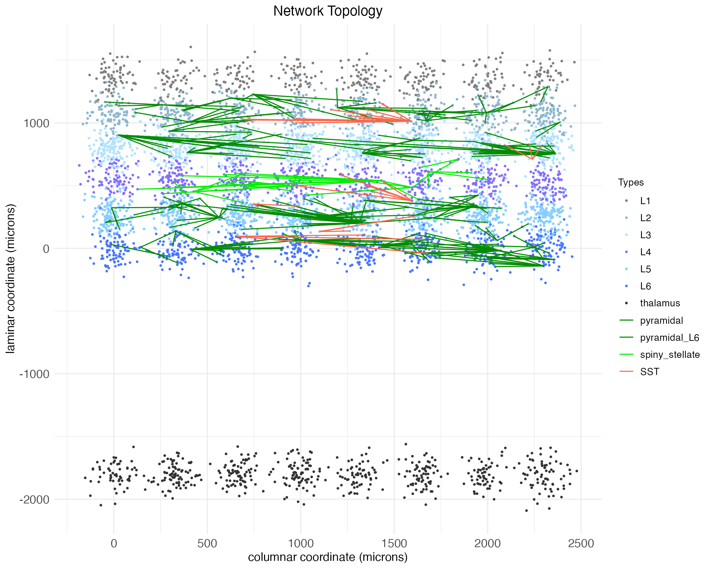

# Network topology from circuit motifs

## Introduction

The mammalian brain has a rich network topology consisting of distinct
hemispheres, distinct cortical (outer) and subcortical (inner) regions,
as well as distinct cellular layers and columns. Connections within the
network take three forms:

1.  local connections between nearby cells,
2.  meso-scale connections within a cortical or subcortical region which
    repeat across layers or columns, and
3.  long-range connections between cortical regions, between cortical
    and subcortical regions, and between hemispheres.

Given that signals take time to propagate along axons and dendrites, the
brain’s complex spatial topology induces complex temporal dynamics
relevant to cognitive function and neural computation.

DACx provides a framework for modeling connections over the brain’s
spatial topology using circuit motifs.[^1] When combined with the
growth-transform (GT) spiking-neuron framework of [Gangopadhyay and
Chakrabartty](https://doi.org/10.3389/fnins.2020.00425), DACx is also
able to model the brain’s complex temporal dynamics.

This tutorial constructs a bilateral (i.e., two-hemisphere) small-scale
network-topology model of the primary auditory cortex, including
subcortical thalamic inputs. Separate tutorials explain the
[mathematics](https://Oviedo-Lab.org/DACx/articles/tutorial_math.md) of
GT models, single-cell [temporal membrane
dynamics](https://Oviedo-Lab.org/DACx/articles/tutorial_membrane_temporal_dynamics.md)
in GT models, and the [extension of GT
models](https://Oviedo-Lab.org/DACx/articles/tutorial_SGT.md) into the
network topology framework of DACx – what we call *spatial
growth-transform* models (SGT).

## Networks

Let’s set up the R environment by clearing the workspace, setting a
random-number generator seed, and loading DACx:

``` r

# Clear the R workspace to start fresh
rm(list = ls())

# Set seed for reproducibility
set.seed(12345) 

# Load DACx package
library(DACx, quietly = TRUE) 
```

Network topologies are held in a special class of objects, network, from
DACx. A new network object can be created with the new.network function.
We’ll call it ACx_mini to reflect how it’s a representation of the
auditory cortex (ACx) using a relatively small number of neurons.

``` r

ACx_mini <- new.network()
```

The network object class is native to C++ and integrated into DACx (an R
package) via Rcpp. The object initialized by new.network is a minimal –
and empty – “single node” network. In this context, “node” does not
necessarily mean a single neuron, but rather a cluster of nearby neurons
with local recurrent connections. (However, a single neuron can be
modeled by making a single-node network from a single-cell node; e.g.,
see the [temporal membrane dynamics
tutorial](https://Oviedo-Lab.org/DACx/articles/tutorial_membrane_temporal_dynamics.md).)
The current structure of our network can be got by calling the
fetch.network.components function.

``` r

ACx_mini_comps <- fetch.network.components(ACx_mini)
```

``` scroll-output
## Summary of network:
##  Number of neurons: 0 
##  Hemisphere names:  
##  Number of hemispheres: 1 
##  Subortical layer names:  
##  Number of subcortical layers: 0 
##  Cortical layer names:  
##  Number of cortical layers: 1 
##  Number of columns: 1 
##  Number of patches: 1 
##  Cell types used:  
##  Motifs used:
```

The returned object ACx_mini_comps is a list containing all components
of the network. For now, the accompanying summary printout is
sufficient. As can be seen, networks initialize essentially empty, i.e.,
with no neurons and no structure. Networks are filled in two steps:

1.  create network nodes with local connections and set the number of
    layers, columns, patches,[^2] and hemispheres with the
    set.network.structure function, then
2.  add meso-scale and long-range connections over those layers,
    columns, patches, and hemispheres via circuit motifs with the
    apply.circuit.motif function.

## Nodes and network structure

DACx assumes that all nodes are (approximately) fully connected, with
all cells synapsing into each other.[^3] This assumption of full
connectivity is inspired by the node model of [Park and Geffen
(2020)](https://doi.org/10.1371/journal.pcbi.1008016). Nodes thus divide
into functionally distinct types *not* by their internal connectivity
(which they all share), but by their *constitutive cell types* and *node
size* (i.e., expected number of neurons per type).

DACx mimicks the structure of the cortex by arraying nodes into layers,
columns, and patches, with possible distinctions between upper
(cortical) and lower (subcortical) regions and bilateral hemispheres.
DACx allows for network node constituents to depend on hemisphere (left
vs right), region (cortical vs subcortical), and layer, but not on the
node’s column.[^4] Within a hemisphere, region, and layer, all columns
(across both the columnar and patch axes) are assumed to have the same
node constituents.

With a network initialized, node constituents and the broader network
structure (e.g., layer and column layout) are set with the
set.network.structure function. To mimic the mammalian auditory system,
we create six layers and array columns in two dimensions (the columnar
and patch axes), with a subcortical thalamic layer and two hemispheres:

``` r

ACx_mini <- set.network.structure(
    ACx_mini,
    neuron_types             = c("principal", "callosal_pyramidal", "callosal_PV", "PV", "SST", "VIP"),
    layer_names              = c("L6", "L5", "L4", "L3", "L2", "L1"),
    subcortical_layer_names  = c("thalamus"),
    n_hemispheres            = 2, 
    n_columns                = 8,
    n_patches                = 4,
    layer_separation_factor  = 3.0,
    column_separation_factor = 5.5,
    patch_separation_factor  = 5.5,
    neurons_per_node         = matrix(c(
    # principal | callosal_ | callosal_ | PV | SST | VIP
    #           | pyramidal | PV        |    |     |
      10,         0,          0,          1,   1,    1, # L6
      10,         3,          2,          1,   1,    1, # L5
      10,         0,          0,          1,   1,    1, # L4
      10,         3,          2,          1,   1,    1, # L3
      10,         0,          0,          1,   1,    1, # L2
      5,          0,          0,          0,   1,    0, # L1
      10,         0,          0,          0,   0,    0  # thalamus
      ), ncol = 6, byrow = TRUE)
  )
```

Notice that we set both a value for n_columns and a value for n_patches.
Each variable controls the size of an independent columnar axis
perpendicular to the laminar axis. By convention, if only one of the two
columnar axes has functional significance (e.g., preserved retinotopy or
preserved tonotopy), it’s assumed to be the one controlled by n_columns.

Notice also that we specified the number of each neuron type in a node
via a matrix neurons_per_node. This matrix must have one column for each
cell type (as shown), and one row per layer, with subcortical layers at
the bottom (also shown). If there are two hemispheres but only a single
row for each layer (as shown above), then the counts provided will be
reused across hemispheres. If the matrix has twice the number of rows as
the number of layers, then it’s assumed that the bottom half of the rows
specify counts for the second (i.e., right) hemisphere, again with
cortical layers first, subcortical layers second. A single value can be
passed as well (which will serve as the number of cells for all cell
types in all layers), or a vector the length of the number of cell types
(which will be used for all layers).

The DACx package predefines some cell types. The process of setting
additional cell types is discussed in the [tutorial on SGT
models](https://Oviedo-Lab.org/DACx/articles/tutorial_SGT.md). The
principal class is special, insofar as it’s not a cell type itself, but
instead points towards the most numerous (i.e., the “principal”) cell
type in each layer. Known principal-layer combinations can be seen by
calling the principal.neurons function:

``` r

principal.neurons(print_nicely = TRUE)
```

``` scroll-output
## Principal neuron types by layer:
##   thalamus: thalmacortical
##   layer: spiny_stellate
##   L1: neurogliaform_cell
##   L2: pyramidal
##   L3: pyramidal
##   L4: spiny_stellate
##   L5: pyramidal
##   L6: pyramidal_L6
```

If we check the summary for our network again, we see that its cell
types include the principal cell types for each layer:

``` r

ACx_mini_comps <- fetch.network.components(ACx_mini)
```

``` scroll-output
## Summary of network:
##  Number of neurons: 5853 
##  Hemisphere names: left, right 
##  Number of hemispheres: 2 
##  Subortical layer names: thalamus 
##  Number of subcortical layers: 1 
##  Cortical layer names: L6, L5, L4, L3, L2, L1 
##  Number of cortical layers: 6 
##  Number of columns: 8 
##  Number of patches: 4 
##  Cell types used: pyramidal_L6, SST, VIP, PV, pyramidal, callosal_pyramidal, callosal_PV, spiny_stellate, neurogliaform_cell, thalmacortical 
##  Motifs used: local connections
```

We can also easily check the number of cells of each type:

``` r

counts <- table(ACx_mini_comps$neuron_type_name)
for (i in c(1:length(counts))) cat(names(counts)[i], ": ", counts[i], "\n", sep = "")
```

``` scroll-output
## callosal_PV: 279
## callosal_pyramidal: 391
## neurogliaform_cell: 369
## PV: 299
## pyramidal: 2042
## pyramidal_L6: 578
## spiny_stellate: 587
## SST: 399
## thalmacortical: 576
## VIP: 333
```

Note that the “Motifs used” field now contains “local connections”. All
cells initialize with a local arbor structure which includes at least
one axon and one dendrite spatially constrained to more-or-less the
space of the cell’s node. The exact shape and branch structure of these
arbors are defined by the cell type, but in all cases are built by a
biased random walk.[^5] This walk generates a tree of nodes. Local
connections are formed by connecting axon nodes to nearby dendrite nodes
to form synapses. By construction, these local connections stay local to
a cell’s node. That is, even if the axon of one cell passes by the
dendrite of a cell in a different node, no synapse will be formed via
the construction of local connections.

At this point, it may be helpful to visualize a sampling of the network
we have created. We will start with a 2D visualization which collapses
the n_patches dimension, but later we will look at the network in 3D.

``` r

plt <- plot.network(ACx_mini)
plt$plot
```



By default, the plot.network function plots all cell bodies as dots,
colored by layer, and plots the arbors for a random 1% of those cell
bodies, colored by cell type. Synapses are plotted as dots. The synapses
shown are determined by the presynaptic axons that are plotted. Notice
that the arbors shown are mostly small and compact, expect for the
pyramidal neurons, which have long apical dendrites extending upwards.
Notice also that the single subcortical layer, thalamus, is a further
distance below the cortical layers than the cortical layers are below
each other.

The plot gives coordinates in microns. Spatial coordinates giving a
cell’s soma (i.e., body) location along the columnar (x), laminar (y),
and patch-hemisphere (z) axes are continuous and real-valued. These
coordinates are used in conjunction with soma-to-synapse distance
(integrated along the axon) and a transmission velocity parameter to
simulate spike propagation.

Seven parameters control the coordinates assigned to each network node:
column diameter c\_{\mathrm{diameter}}, layer height
l\_{\mathrm{height}}, column separation factor F\_{\mathrm{column}},
layer separation factor F\_{\mathrm{layer}}, patch separation factor
F\_{\mathrm{patch}}, subcortical separation factor F\_{\mathrm{sub}},
and hemisphere separation factor F\_{\mathrm{hemi}}. A node is created
for each combination of zero-based integer-indexed patch p, layer l,
column c, and hemisphere h. Each node is assigned a coordinate \langle
x_c,y_l,z\_{p\times h}\rangle: z\_{p\times h} = p
\frac{c\_{\mathrm{diameter}}F\_{\mathrm{patch}}}{2} + h
\frac{c\_{\mathrm{diameter}}F\_{\mathrm{hemi}}}{2} y_l = l
\frac{l\_{\mathrm{height}}F\_{\mathrm{layer}}}{2} x_c = c
\frac{c\_{\mathrm{diameter}}F\_{\mathrm{column}}}{2} Cortical and
subcortical layers are indexed by independent series l. The above
formula for y_l is used in both cases; however, if computing node
coordinates for subcortical layers, an addition term
l\_{\mathrm{height}}F\_{\mathrm{sub}}/2 is subtracted from y_l. Within
each node, a coordinate \langle z_n,y_n,x_n\rangle is assigned to each
neuron n by sampling from a normal distribution: z_n \sim
\mathcal{N}(z\_{p\times h}, \frac{c\_{\mathrm{diameter}}}{2}) y_n \sim
\mathcal{N}(y_l, \frac{l\_{\mathrm{height}}}{2}) x_n \sim
\mathcal{N}(x_c, \frac{c\_{\mathrm{diameter}}}{2}) By default, DACx sets
c\_{\mathrm{diameter}} = 120.0, l\_{\mathrm{height}} = 180.0,
F\_{\mathrm{patch}} = 2.5, F\_{\mathrm{column}} = 2.5,
F\_{\mathrm{layer}} = 2.5, F\_{\mathrm{sub}} = 20, and
F\_{\mathrm{hemi}} = 40. The above network ACx_mini used larger values
for the column and patch separation factors so that the columns would be
more visually distinct in plots.

These default values were obtained via back-of-the-envelope calculations
from widefield microscopy images of wild-type mouse auditory cortex.
They can be extended to estimate values needed to simulate a complete
brain area. By eyeballing those same images (multiplying pixels by a
resolution of 0.4 microns per pixel), we estimate a mean neuronal soma
diameter of 14 microns, cluster radius of 62 microns, and cluster
density (i.e., proportion of cluster occupied by neuronal somas) of 0.4.
These numbers imply approximately 278 cells per cluster. Assuming a span
of 13 columns across the tonotopic axis of the auditory cortex
(approximately 2 mm) and a patch depth of 3 perpendicular to it
(approximately 0.5 mm), six layers at that cluster density is
approximately 65,000 neurons total, which is a fair approximation for a
single hemisphere of mouse auditory cortex. Of course, for demonstration
purposes we will stick to the much smaller network we’ve already
created, but these calculations show how the parameters of the
set.network.structure function can be used to scale up to a more
realistic network size.

Returning to our demonstration network, we have only “local” connections
between neighboring neurons. Next, we will add meso-scale and long-range
connections using circuit motifs.

## Circuit motifs

A circuit motif, represented in the DACx package by special objects of
class motif, is a predefined pattern of connections between layers and
columns in a network, either within a single cortical region or across
regions. It is a recipe for directing axons – and thereby connecting
cells – between nodes, based on (1) cell type and (2) pre and
post-synaptic node coordinates.[^6]

Below we will define and load six canonical circuit motifs thought to
characterize sensory cortex:

1.  **Principal columnar projections:** a translaminar and intracolumnar
    projection motif of principal (i.e., excitatory) columnar
    projections ([Harris and Mrsic-Flogel
    2013](https://doi.org/10.1038/nature12654)).
2.  **Auditory lateral projections:** a lateral projection motif for
    cross-columnar communication ([Park and Geffen
    2020](https://doi.org/10.1371/journal.pcbi.1008016)).
3.  **Bottom-up intracolumnar inhibitory projections:** a translaminar
    deep-layer PV arborization motif for intracolumnar inhibition
    ([Bortone et
    al. 2014](https://doi.org/10.1016/j.neuron.2014.02.021), [Frandolig
    et al. 2019](https://doi.org/10.1016/j.celrep.2019.08.048)).
4.  **Top-down intracolumnar inhibitory projections:** a motif for
    intracolumnar inhibition based around the neurogliaform cells of L1
    and the apical dendrites of pyramidal neurons ([Huang et
    al. 2024](https://doi.org/10.1016/j.neuron.2023.09.041)).
5.  **Thalmacortical projections:** from the thalamus up into the
    cortex, providing the cortex with sensory input from the periphery.
6.  **Corpus callosum:** Projections connecting the cortex of the two
    hemispheres ([Barbaresi et
    al. 2024](https://doi.org/10.3389/fphys.2024.1393000)).

Roughly speaking, these motifs are “columnar”, in the sense that they
are defined relative to a single cortical column and repeated across all
columns, both along the primary columnar axis sized by n_columns and the
secondary columnar axis sized by n_patches.

### Principal columnar projections

The new.motif function initializes an empty motif object. Let’s
initialize one to model the canonical translaminar, intracolumnar
principal (i.e., excitatory) projections in the sensory cortex. These
connections are largely what defines a “column” in the cortex, and thus
they connect neurons in different layers while staying within the same
column.

``` r

motif.pp <- new.motif(motif_name = "principal projections")
```

Connections between layers are added to the motif using the
load.projection.into.motif function. This function takes as arguments
the motif object, the source layer name, and the target layer. By
default, it extends the axons of principal cells in the source layer to
principal cells in the target layer with a connection strength of 0.1 nS
(equivalent to a 5 pA current at 50 mV). The connection strength value,
held in the variable connection_strength, is used to control the
expected initial strength of synapses along the extended axon. This
value can be modified via a fourth argument to the function. Here, for
example, we load projections with connection strength of 0.2 nS from
layer L4 to layer L2 and layer L3 into our new motif:

``` r

motif.pp <- load.projection.into.motif(motif.pp, "L4", "L2", 0.2)
motif.pp <- load.projection.into.motif(motif.pp, "L4", "L3", 0.2)
```

We have increased the strength of this connection from the default
because layer 4 (the primary site of input from outside the cortex into
the cortex) has its strongest intra-cortical projections to layers 2 and
3. By default, the loaded projections are between principal neurons,
which for layer 4 are spiny stellate cells and for layers 2 and 3 are
pyramidal neurons. Below we will show how the pre and post-synaptic cell
types can be modified through additional function arguments. For now,
let’s load weaker projections from layer 4 into the deep layers below
it:

``` r

motif.pp <- load.projection.into.motif(motif.pp, "L4", "L5", 0.05)
motif.pp <- load.projection.into.motif(motif.pp, "L4", "L6", 0.05)
```

The column-defining principle projections also typically include
recurrent loops between layers 2 and 3 and layer 5, which we’ll assume
are of average (i.e., default) strength:

``` r

motif.pp <- load.projection.into.motif(motif.pp, "L2", "L5") 
motif.pp <- load.projection.into.motif(motif.pp, "L3", "L5")
motif.pp <- load.projection.into.motif(motif.pp, "L5", "L2")
motif.pp <- load.projection.into.motif(motif.pp, "L5", "L3")
```

Finally, these projections also include a feed-forward projection from
layer 5 to layer 6, and a feedback projection from layer 6 to layer 4:

``` r

motif.pp <- load.projection.into.motif(motif.pp, "L5", "L6", 0.05)
motif.pp <- load.projection.into.motif(motif.pp, "L6", "L4", 0.05)
```

With the complete principle-projection motif defined, we apply it using
the apply.circuit.motif function. This function takes as arguments the
network object and the motif object. It adds the connections defined in
the motif to the network.

``` r

ACx_mini <- apply.circuit.motif(
    ACx_mini,
    motif.pp
  )
```

Let’s plot the results of applying this motif. We could update our
original plot, i.e., plot the same cells arbors again, seeing how this
motif has changed and grown them. The plot.network function returns not
only the generated plot, but also the indexes for the plotted somas (in
soma_mask) and arbors (in arbor_idx). This allows for plots to be
reproduced as a network is built out, showing the same cell arbors as
more motifs are added.

However, as the emphasis here is the motif itself, we will instead use
the plot_motif to specify that we want to plot arbors which were in part
built from a specific motif. Cell arbors are potentially the result of
multiple motifs, e.g., local connections plus principal projections plus
anything else we add. By specifying “principal projections”, the entire
arbor cell each randomly selected cell (by default, 1% of available
cells) will be plotted, not just the portion of the arbor constructed
from the principal projections motif. Still, we get a sense for the
shape of the motif and how it connects cells in the network.

``` r

plt <- plot.network(
    ACx_mini,
    plot_motif = "principal projections"
  )
plt$plot
```



We can also plot the network in 3D, showing the full spatial shape of
the arbors. To ensure we are plotting the same arbors shown in the 2D
plot above, this time we will use the arbor_idx argument and the
previously returned arbor indexes.

``` r

plt <- plot.network(
    ACx_mini,
    arbor_idx  = plt$arbor_idx,
    threedim   = TRUE,
    plot_motif = "principal projections"
  )
plt$plot
```

Notice, as is clear in both the 2D and 3D plots, that while the arbors
cross between layers, they all mostly remain in column. There are no
meso-scale *lateral* projections *between* columns.

### Auditory lateral projections

Within sensory cortex, cortical columns tend to respond to a single type
of stimulus. For example, cortical columns in the visual cortex might
have preferred edge orientations while columns in the auditory cortex
prefer certain sound frequencies. More advanced cortical computations
require integrating input from a range of stimuli (e.g., a range of edge
orientations or sound frequencies), and thus there must be some
mechanism of column cross-talk. This is thought to be accomplished by
lateral connections between cells of the same layer, but different
columns. For example, [Park and Geffen
(2020)](https://doi.org/10.1371/journal.pcbi.1008016) propose that these
lateral connections include (1) excitatory projections from principal
cells out to principal cells and PV and SST interneurons in adjacent
columns and (2) inhibitory projections from SST interneurons out
specifically to principle (excitatory) neurons in adjacent columns.
Thus, for this motif, we need to make use of the presynaptic_type and
postsynaptic_type arguments of the load.projection.into.motif function
to specify the relevant neuron types for each projection.

By default, load.projection.into.motif creates projections within the
same column. To create lateral projections, we need to use the
max_col_shift_up and max_col_shift_down arguments of the function to
specify how many columns away from the source column the target column
can be. For the purposes of this demonstration, we’ll set these to four.
However, lateral projections are assumed to drop off exponentially, and
so when the apply.circuit.motif function is called, the actual length of
any lateral branch projection will be a random value placing its
expected endpoint somewhere between the source column and four columns
away.

The arguments max_pch_shift_up and max_pch_shift_down serve the same
function for spreading lateral projections along the secondary columnar
axis. In this case, we’ll set the values to the patch axis to two. When
lateral projections are expected along both columnar axes, they grow as
some random linear combination of one of the following four (randomly
choosen) cardinal direction pairs: {column-up, patch-up}, {column-down,
patch-down}, {column-up, patch-down}, and {column-down, patch-up}. The
same exponential decay applies.

``` r

motif.ACxlat <- new.motif(motif_name = "ACx laterals")
# Add projection for each layer
for (layer in c("L2", "L3", "L4", "L5", "L6")) {
  # Excitatory laterals 
  for (celltype in c("principal", "PV", "SST")) {
    motif.ACxlat <- load.projection.into.motif(
      motif.ACxlat, 
      presynaptic_layer  = layer, 
      postsynaptic_layer = layer, 
      presynaptic_type   = "principal", 
      postsynaptic_type  = celltype,
      max_col_shift_up   = 4,
      max_col_shift_down = 4,
      max_pch_shift_up   = 2,
      max_pch_shift_down = 2
    )
  }
  # Inhibitory laterals
  motif.ACxlat <- load.projection.into.motif(
    motif.ACxlat, 
    presynaptic_layer  = layer, 
    postsynaptic_layer = layer, 
    presynaptic_type   = "SST", 
    postsynaptic_type  = "principal",
    max_col_shift_up   = 4,
    max_col_shift_down = 4,
    max_pch_shift_up   = 2,
    max_pch_shift_down = 2
  )
}
```

As before, we can apply this motif and visualize the results:

``` r

ACx_mini <- apply.circuit.motif(
    ACx_mini,
    motif.ACxlat
  )
plt <- plot.network(
    ACx_mini,
    threedim   = TRUE,
    plot_motif = "ACx laterals"
  )
plt$plot
```

Now we have not only vertical projections between layers, but horizontal
projections between columns.

### Bottom-up intracolumnar inhibitory projections

Cortical computations require careful balance between excitatory and
inhibitory activity, both within local nodes and between nodes within
columns. Balancing the principal columnar projections – which are
predominantly excitatory – are two types of inhibitory projections. The
first are intracolumnar inhibitory projections from PV interneurons out
of L6 ([Bortone et
al. 2014](https://doi.org/10.1016/j.neuron.2014.02.021), [Frandolig et
al. 2019](https://doi.org/10.1016/j.celrep.2019.08.048)). These function
to shut the column down and are largely driven by bottom-up thalamic
input.

Let’s define a motif for these inhibitory projections. For this motif,
we again need to make use of the presynaptic_type and postsynaptic_type
arguments of the load.projection.into.motif function to specify that
this projection motif is from inhibitory PV neurons to excitatory
principal neurons.

``` r

motif.Binhib <- new.motif(motif_name = "bottom-up inhibition")
motif.Binhib <- load.projection.into.motif(
    motif.Binhib,
    presynaptic_layer  = "L6",
    postsynaptic_layer = c("L5", "L4", "L3", "L2"),
    presynaptic_type   = "PV",
    postsynaptic_type  = "principal"
  )
```

For now, we will define only the PV \rightarrow principal component of
this motif. The fact that the PV cells themselves receive input from the
thalamus will be handled later, via the thalamic input motif. As before,
we can apply this motif and visualize the results.

``` r

ACx_mini <- apply.circuit.motif(
    ACx_mini,
    motif.Binhib
  )
plt <- plot.network(
    ACx_mini,
    threedim   = TRUE,
    plot_motif = "bottom-up inhibition"
  )
plt$plot
```

As can be seen, now the deep-layer PV cell arbors (in magenta) are
extending their axons upwards towards the superficial layers, as
expected from the motif.

Notice that in this case we’ve loaded multiple projections at once by
specifying a vector of target layers. While the argument
presynaptic_layer can take only a single value, if postsynaptic_layer is
given a vector of layer names, projections will be loaded from the
presynaptic layer to each of the specified postsynaptic layers. In this
case, the pre and post-synaptic neuron types are the same for each
projection, but if different types were required, then multiple calls to
the load.projection.into.motif function would be necessary.

### Top-down intracolumnar inhibitory projections

The second type of inhibitory projections balancing excitatory input are
driven by neurogliaform cells in L1. Within the cortex, L1 is distinct
insofar as it consists almost entirely of the tufts of apical dendrites
from lower-layer pyramidal cells. Roughly speaking (and consistent with
how DACx implements circuit topologies), cortical pyramidal cells
receive local and meso-scale input on their basal dendrites, while large
apical dendrites receive “top-down” feedback from higher cortical areas
(e.g., apical dendrites from V1 receive input from V2) and higher-order
thalamus.

While DACx does not support multiple cortical regions within a single
hemisphere (e.g., a V2 functionally distinct from V1),[^7] it does
support modeling a second circuit pattern involving apical dendrites.
The apical dendrites of pyramidal cells receive inhibitory input from
the neurogliaform cells in L1 ([Huang et
al. 2024](https://doi.org/10.1016/j.neuron.2023.09.041)). To implement
this motif in DACx, we use the via_apical argument while keeping
presynaptic and postsynaptic layers the same.

``` r

motif.Tinhib <- new.motif(motif_name = "top-down inhibition")
# neurogliaform targeting of apical dendrites
motif.Tinhib <- load.projection.into.motif(
    motif.Tinhib, 
    presynaptic_layer  = "L1", 
    postsynaptic_layer = "L1", 
    presynaptic_type   = "neurogliaform_cell", # "principal" would work too
    postsynaptic_type  = "pyramidal",
    via_apical         = TRUE
  )
```

Neurogliaform cells also target each other and nearby L2/3 PV
interneurons.

``` r

# neurogliaform self-targeting
motif.Tinhib <- load.projection.into.motif(
    motif.Tinhib, 
    presynaptic_layer  = "L1", 
    postsynaptic_layer = "L1", 
    presynaptic_type   = "neurogliaform_cell",
    postsynaptic_type  = "neurogliaform_cell"
  )
# neurogliaform PV-targeting
motif.Tinhib <- load.projection.into.motif(
    motif.Tinhib,
    presynaptic_layer  = "L1",
    postsynaptic_layer = c("L2", "L3"),
    presynaptic_type   = "neurogliaform_cell",
    postsynaptic_type  = "PV"
  )
```

SST interneurons in L2/3 complete this meso-scale inhibitory circuit by
targeting both the L1 neurogliaform cells and the L1 apical tufts of
L2/3 pyramidal cells. However, as we’ve set the network up so far, we
are not able to implement this projection. We could set via_apical to
TRUE and set postsynaptic_layer to c(“L2”, “L3”), but this would not
work. The effect of setting via_apical to TRUE is to find synapses only
along apical dendrites and to determine which cells to check by whether
they have an apical dendrite targeting the postsynaptic layer instead of
by whether their soma is located in the postsynpatic layer.

In line with how the biology itself works, implementing this projection
in DACx would require distinguishing L2/3 pyramidal cells from other
kinds of pyramidal cells. We would then set postsynaptic_layer to L1, so
that axons went to the location of the apical dendrites, and set
postsynaptic_type to this new L2/3-specific pyramidal cells, so that
these axons only synapsed with the apical dendrites of pyramidal cells
in L2/3. These changes would be relatively straightforward, but we will
not implement them in this tutorial.

What about the sources of input to neurogliaform cells? These cells
receive input from non-local sources, such as higher order cortex and
thalamus, but also from L5 IT pyramidal and L6b pyramidal cells.[^8]
While we haven’t set up a special cell type for L5 IT pyramidal cells or
distinct types of L6 pyramidal cells, for demonstration purposes we can
use the pyramidal_L6 as a stand in:

``` r

# Local columnar input
motif.Tinhib <- load.projection.into.motif(
    motif.Tinhib,
    presynaptic_layer  = "L6",
    postsynaptic_layer = "L1",
    presynaptic_type   = "pyramidal_L6",
    postsynaptic_type  = "neurogliaform_cell"
  )
```

Let’s finally apply and view the motif:

``` r

ACx_mini <- apply.circuit.motif(
    ACx_mini,
    motif.Tinhib
  )
plt <- plot.network(
    ACx_mini,
    threedim   = TRUE,
    plot_motif = "top-down inhibition"
  )
plt$plot
```

### Thalmacortical projections

Thus far we’ve only created meso-scale connections within a single
cortical region. However, we also need connections between regions.
First, we need our subcortical region (the thalamus) to talk to the
cortical region above it. The thalamus receives its inputs from the
periphery. In the case of audition, this means the cochlea.
Thalmacortical cells in the auditory thalamus send their inputs to the
auditory cortex in a way which preserves the tonotopic axis of auditory
processing. For simplicity, we will assume that tonotopy is preserved
because projections stay in column, without lateral shifts. Further,
while thalmacortical projections synpase into all cortical layers
(except L1), the connections to L4 are the strongest.

The thalmacortical projection motif is implemented as follows:

``` r

motif.tc <- new.motif(motif_name = "thalmacortical projections")
motif.tc <- load.projection.into.motif(motif.tc, "thalamus", "L4", 0.2)
motif.tc <- load.projection.into.motif(motif.tc, "thalamus", "L2", 0.05)
motif.tc <- load.projection.into.motif(motif.tc, "thalamus", "L3", 0.05)
motif.tc <- load.projection.into.motif(motif.tc, "thalamus", "L5", 0.05)
motif.tc <- load.projection.into.motif(motif.tc, "thalamus", "L6", 0.05)
```

The above projections all involve principal thalamic cells synapsing
onto principal cortical cells. However, there is some evidence that the
thalmacortical projections into L6 also target the same PV cells
involved in the intracolumnar inhibitory motif ([Frandolig et
al. 2019](https://doi.org/10.1016/j.celrep.2019.08.048)), with stronger
input than received by the principal excitatory cells.

``` r

motif.tc <- load.projection.into.motif(
    motif.tc, 
    presynaptic_layer      = "thalamus", 
    postsynaptic_layer     = "L6", 
    projection_conductance = 0.1, 
    postsynaptic_type      = "PV"
  )
```

Let’s apply and plot it:

``` r

ACx_mini <- apply.circuit.motif(
    ACx_mini,
    motif.tc
  )
plt <- plot.network(
    ACx_mini,
    threedim   = TRUE,
    plot_motif = "thalmacortical projections"
  )
plt$plot
```

### Corpus callosum

The second type of inter-region connection that’s needed is between the
cortices of the two hemispheres. In mammals, this is largely
accomplished by the corpus callosum. While the exact nature of the
corpus callosum varies by species and is disputed, we will assume that
callosal projections preserve layer and column identity, connect the
hemispheres only at L3 and L5, and include both excitatory cells
(callosal pyramidal neurons) and inhibitory cells (callosal PV
interneurons).

Let’s build and apply the corpus callosum motif. As can be seen in the
code, the key is the hem_shift argument. Here we have set it to 1, which
means that the postsynaptic layer and column are located in the
contralateral hemisphere. The default value of hem_shift, used above in
all other motif projections, is 0. This default keeps the postsynaptic
layer and column within the same hemisphere as the presynaptic layer and
column.

``` r

projection_conductance <- 1e-10
motif.CC <- new.motif(motif_name = "corpus callosum")
motif.CC <- load.projection.into.motif(motif.CC, "L3", "L3", presynaptic_type = "callosal_pyramidal", postsynaptic_type = "pyramidal", hem_shift = 1)
motif.CC <- load.projection.into.motif(motif.CC, "L5", "L5", presynaptic_type = "callosal_pyramidal", postsynaptic_type = "pyramidal", hem_shift = 1)
motif.CC <- load.projection.into.motif(motif.CC, "L3", "L3", presynaptic_type = "callosal_PV",        postsynaptic_type = "pyramidal", hem_shift = 1)
motif.CC <- load.projection.into.motif(motif.CC, "L5", "L5", presynaptic_type = "callosal_PV",        postsynaptic_type = "pyramidal", hem_shift = 1)
ACx_mini <- apply.circuit.motif(
    ACx_mini,
    motif.CC
  )
```

And update our plot:

``` r

plt <- plot.network(
    ACx_mini,
    threedim   = TRUE,
    plot_motif = "corpus callosum"
  )
plt$plot
```

## Network topology summary

Let’s return again to the fetch.network.components function and look at
the network now:

``` r

ACx_mini_comps <- fetch.network.components(ACx_mini, include_arbors = TRUE, return_arbors = FALSE)
```

``` scroll-output
## Summary of network:
##  Number of neurons: 5853 
##  Number of synapses: 80155 
##  Hemisphere names: left, right 
##  Number of hemispheres: 2 
##  Subortical layer names: thalamus 
##  Number of subcortical layers: 1 
##  Cortical layer names: L6, L5, L4, L3, L2, L1 
##  Number of cortical layers: 6 
##  Number of columns: 8 
##  Number of patches: 4 
##  Cell types used: pyramidal_L6, SST, VIP, PV, pyramidal, callosal_pyramidal, callosal_PV, spiny_stellate, neurogliaform_cell, thalmacortical 
##  Motifs used: local connections, principal projections, ACx laterals, bottom-up inhibition, top-down inhibition, thalmacortical projections, corpus callosum
```

In addition to what’s printed, the function also extracts other
important summary information. For example, here are the mean numbers of
synapses per pre-synaptic neuron, per cell type:

``` r

print(aggregate(n_synapses ~ neuron_type, data = ACx_mini_comps$synapse_info, FUN = mean))
```

``` scroll-output
##           neuron_type n_synapses
## 1         callosal_PV  12.168459
## 2  callosal_pyramidal  12.480818
## 3  neurogliaform_cell   9.338753
## 4                  PV   7.545151
## 5           pyramidal  16.262488
## 6        pyramidal_L6  12.217993
## 7      spiny_stellate  19.359455
## 8                 SST   8.220551
## 9      thalmacortical  16.026042
## 10                VIP   6.105105
```

Before concluding, two other plotting options are helpful in exploring a
network’s topology. First, for both 2D and 3D plots, the complex arbors
can be replaced by straight-line edges between pre and post-synaptic
cells, allowing synaptic connections to be seen directly. For example,
we see only synaptic connections added as a result of applying the
lateral projection motif:

``` r

plt_lat <- plot.network(
    ACx_mini, 
    plot_motif         = "ACx laterals",
    reconstruct_arbors = FALSE
  )
plt_lat$plot
```



For both 2D and 3D plots, cell arbors can be colored by process type,
i.e., whether they are an axon or dendrite. Here, for example, is our
network plotted in 3D with a random 1% of arbors colored by process
type:

``` r

plt <- plot.network(
    ACx_mini,
    threedim   = TRUE,
    edge_color = "is_axon"
  )
plt$plot
```

To conclude, let’s plot 10% of process arbors (colored by cell type) to
get a feel for the full richness of the network:

``` r

plt <- plot.network(
    ACx_mini,
    threedim      = TRUE,
    arbor_density = 0.1
  )
plt$plot
```

[^1]: As of v1.0, DACx is unable to model connections within a
    hemisphere between two distinct cortical regions, e.g., between
    auditory and motor cortex. However, an extension to this case would
    be straightforward: simply add a “region” index which adds cell
    nodes at a distance along the columnar (x) axis, similar to how
    hemispheres are modeled by extending a new index along the patch (z)
    axis.

[^2]: Patches are a third spatial axis which, like columns, is
    orthogonal to the laminar axis.

[^3]: This tutorial will use the terms “cell” and “neuron” more-or-less
    interchangeably.

[^4]: … and not on the node’s location along the secondary columnar
    axis, patch.

[^5]: That is, biased to tend away from the soma, and sometimes also
    towards attractor points.

[^6]: Node coordinates include hemisphere, patch, layer (cortical or
    subcortical), and column indices.

[^7]: At least, not as of v1.0. See the first footnote on what is
    required.

[^8]: L6b cells don’t have apical dendrites in L1, so this does not form
    a recurrent loop.
