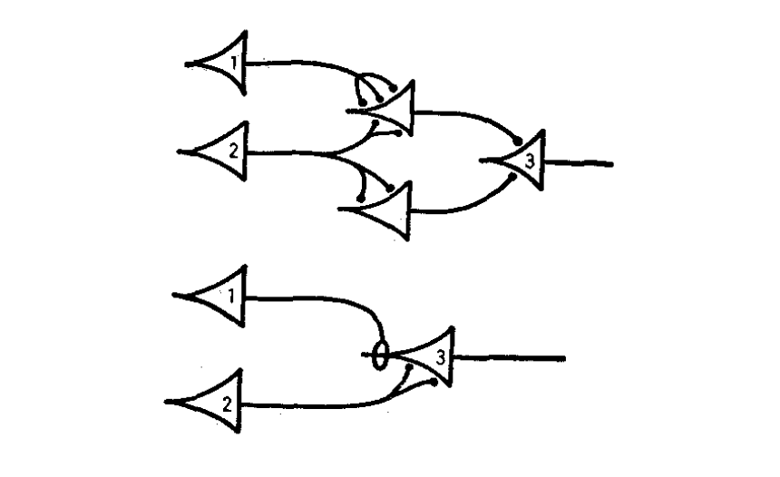

```{r Rmdsetup, echo=FALSE}
# Set max width of markdown code outputs
options(width = 10000)
knitr::opts_chunk$set(class.output = "scroll-output", cache = TRUE)
```

<div class="figure">
  
</div>

<h2>Introduction</h2>

The simplest mathematical models of neural networks are built from homogeneous McCulloch-Pitts neurons with atemporal, scalar-weight connections between them. Biological neural networks, such as those in the mammalian brain, are far more complex. They contain different types of neurons each with their own electrical behavior and spatiotemporally extended connections. 

<div class="figure">
  
  <p class="caption">A sample neural network diagram from the original [1943 paper](https://link.springer.com/article/10.1007/BF02478259) by McCulloch and Pitts.</p>
</div>

Computational neuroscientists standardly model biological neural networks as [dynamical systems](https://philpapers.org/rec/ELIMBM-3), i.e., as having time-dependent states. [Growth-transform](https://doi.org/10.3389/fnins.2020.00425) (GT) models, extended to spiking neural networks by Gangopadhyay and Chakrabartty, are one example. These models treat the change in membrane potential over time, $\partial v/\partial t$, as a growth-transform of the membrane potentials $v$ on the net metabolic power $\mathcal{H}$ of a network, in the sense that it's assumed that $\partial v/\partial t$ satisfies the [Baum-Eagon inequality](https://doi.org/10.1090/S0002-9904-1967-11751-8): 
\[\mathcal{H}(v)\leq \mathcal{H}(v + \partial v/\partial t)\]
In other words: 
\[\frac{\partial\mathcal{H}}{\partial v}\frac{\partial v}{\partial t} \leq 0\]
Thus, GT models are essentially energy-minimization models of neural dynamics. This is in contrast to models such as Hodgkin-Huxley, which describe neural dynamics directly in terms of ionic currents. Despite this apparent disconnect from biology, DACx is based on a [biological interpretation](tutorial_math.html) of the underlying mathematics of GT models. 

In practical terms, instead of only a weight between two homogeneous neurons, GT models use both a cell-type-dependent synaptic conductance parameter and a cell-type-dependent temporal modulation factor to determine network behavior. The synaptic conductance parameter is essentially a traditional connection weight, while the [temporal modulation factor](tutorial_membrane_temporal_dynamics.html) allows for capturing the electrodynamics $\partial v/\partial t$ of different neuron types at a single spatial point. 

The GT models implemented in the DACx package add a third aspect of biological realism not captured by the original formulation of Gangopadhyay and Chakrabartty: a transmission velocity parameter for each neuron type. While the temporal modulation factor controls membrane voltage over time at a *single* spatial point, the transmission velocity parameter determines the rate at which changes in membrane voltage *propagate between neurons*. 
For this reason, we refer to our GT models as *biological GT* (BGT) models. 

BGT models thus allow for network topologies that not only capture connection strengths between neurons, but also the different types of neurons and their electrodynamics across both time *and space*. A [separate tutorial](tutorial_network_topology.html) demonstrates how to build spatially extended network topologies for these models from circuit motifs. This tutorial explains BGT models in more detail. 

Suppose our network has $n$ neurons $N$. We want to run a simulation of the membrane potential $v(t)$ of each neuron $N$ over time $t$. Naturally, the system evolves so that: 
\[v(t+1) = v(t) + \left.\frac{\partial v}{\partial t}\right|_{t+1}\]
The hard part, of course, is to compute $\partial v/\partial t$. That is, how do membrane potentials evolve over time? 

<h2>Power minimization</h2>

To tackle this question, [Gangopadhyay and Chakrabartty](https://doi.org/10.3389/fnins.2020.00425) applied the [Baum-Eagon inequality](https://doi.org/10.1090/S0002-9904-1967-11751-8) to the net metabolic power $\mathcal{H}$ of $v$ to derive $\partial v/\partial t$ as a growth-transform of $v$. That is, they assumed that $\partial v/\partial t$ is always such that:
\[\mathcal{H}(v)\leq \mathcal{H}(v + \partial v/\partial t)\]
This amounts to assuming that $\mathcal{H}$ is minimized over time:
\[\frac{\partial\mathcal{H}}{\partial v}\frac{\partial v}{\partial t} \leq 0\]
Here, we will work directly from this minimization assumption and use a biologically inspired interpretation of the variables to derive $\partial v/\partial t$. For simplicity, let us assume that $\partial\mathcal{H}/\partial t = 0$, i.e., that the metabolic power is not changing over time. 

Also, let us assume that $v$ represents only the _subthreshold_ membrane potential and thus that $\partial v/\partial t$ only _directly_ models subthreshold membrane potential dynamics.[^1] This leaves out any mechanistic modeling of spikes themselves. Instead, spikes are modeled as a constant and instantaneous value $v_\mathrm{spike}$ (variable <span class = "code_variable">spike_potential</span> in the simulation) added to the subthreshold dynamics when the spike threshold is crossed. We will explain below how spikes are nevertheless still critical to the evolution of the system.

[^1]: Hereafter we leave the qualifier "subthreshold" implicit. 

Where do we begin? It's plausible that the membrane potential $v$ is a scalar multiple $fv_\mathrm{rest}$ of the resting potential $v_\mathrm{rest}$,[^rest] where the scale factor $f$ is a function of $\partial\mathcal{H}/\partial v$. In other words, we assume that the scale factor $f$ depends on how a small change $\partial v$ in membrane potential would change net metabolic power $\mathcal{H}$. Hence, we have that:[^vbound]
\[v(t+1) =  v(t) + \left.\frac{\partial v}{\partial t}\right|_{t+1} = f\left(\left.\frac{\partial\mathcal{H}}{\partial v}\right|_{t+1}\right)v_\mathrm{rest}\]

[^rest]: Technically, the resting potential is the equilibrium point towards which the membrane potential tends in the absence of any input.

[^vbound]: [Gangopadhyay and Chakrabartty](https://doi.org/10.3389/fnins.2020.00425) assume that the absolute value of the quantity of which membrane potential is a multiple is a bound on membrane potential. Within the simulation code, the relevant variable is <span class = "code_variable">v_bound</span>, which is given a value slightly higher than the absolute value of the rest potential. If the value isn't increased slightly, the rest potential becomes an infinite well that can't be escaped.

<h2>Scale factor</h2>

Therefore, if we could find a suitable scale factor $f$, we'd be able to compute $\partial v/\partial t$ as: 
\[\left.\frac{\partial v}{\partial t}\right|_t = f\left(\left.\frac{\partial\mathcal{H}}{\partial v}\right|_{t}\right)v_\mathrm{rest} - v(t-1)\]
Combining the previous equation with the minimization assumption, we have: 
\[\frac{\partial\mathcal{H}}{\partial v} \left(f\left(\left.\frac{\partial\mathcal{H}}{\partial v}\right|_t\right)v_\mathrm{rest} - v(t-1) \right) = 0\]
Assuming $\partial\mathcal{H}/\partial v \neq 0$, this equation implies that: 
\[v(t-1) = f\left(\left.\frac{\partial\mathcal{H}}{\partial v}\right|_t\right)v_\mathrm{rest}\]
And so: 
\[f\left(\left.\frac{\partial\mathcal{H}}{\partial v}\right|_t\right) = \frac{v(t-1)}{v_\mathrm{rest}}\]
Hence, we see that $f$ is a function of the metabolic power gradient $\partial\mathcal{H}/\partial v$ that's equal to the ratio of $v$ over the rest potential $v_\mathrm{rest}$. An immediate consequence is that, when $v\approx v_\mathrm{rest}$, the scale factor $f$ is approximately $1$. Hence, we are assuming that $v_\mathrm{rest}$ is an equilibrium point (as defined by dynamical systems theory) of the membrane potential. 

Notice that this derivation implies that $\partial v/\partial t=0$, which may seem obviously wrong. However, we are attempting to derive a formula for $\partial v/\partial t$ which makes $\partial\mathcal{H}/\partial t=0$. The "makes" is aspirational: of course, $\partial v/\partial t\neq 0$, but, what general form of $\partial v/\partial t$ will tend to make $\partial\mathcal{H}/\partial t=0$ over time? In terms of biology, we can alternatively think of the system as _trying_ to maintain a stable rest voltage $v_\mathrm{rest}$, and the question is: what form of $\partial v/\partial t$ will best achieve this goal?

<h2>Rest vs spike power</h2>

In order to solve for $f$, it's helpful to think about the metabolic power gradient $\partial\mathcal{H}/\partial v$ and how it relates to two quantities: the metabolic power $\mathcal{H}_\mathrm{rest}$ of maintaining rest potential $v_\mathrm{rest}$ and the metabolic power $\mathcal{H}_\mathrm{spike}$ of initiating a spike under the conditions which hold at time $t$. As a linear approximation, we have that: 
\[\mathcal{H}_\mathrm{rest} = v_\mathrm{rest}\left.\frac{\partial\mathcal{H}}{\partial v}\right|_t\]
This equation is justified because the metabolic power $\mathcal{H}_\mathrm{rest}$ of maintaining rest potential $v_\mathrm{rest}$ is equal to the power used to maintain the negative potential $v_\mathrm{rest}$ under the natural positive flow of charge into the cell. Unit analysis ($\mathrm{Watts} = \mathrm{Volts} \times \mathrm{Ampere}$) implies that this latter quantity must be the power gradient $\partial\mathcal{H}/\partial v$ evaluated at $t$. 

What about the metabolic power $\mathcal{H}_\mathrm{spike}$ of initiating a spike? If $v_\mathrm{threshold}$ is the membrane potential at spike threshold, then (by the above unit analysis) the change $\partial I_\mathrm{influx}$ in current $I$ across the membrane at spike initiation is: 
\[\partial I_\mathrm{influx} = \left.\frac{\partial\mathcal{H}}{\partial v}\right|_{v_\mathrm{threshold}}\]
and the metabolic power required to produce a spike is approximately:
\[\mathcal{H}_\mathrm{spike} = v\partial I_\mathrm{influx}\]

The values $\mathcal{H}_\mathrm{rest}$ and $\mathcal{H}_\mathrm{spike}$ are helpful because, at any moment $t$, whether there is a spike depends on how they relate. If $\mathcal{H}_\mathrm{spike} < \mathcal{H}_\mathrm{rest}$, then the neuron will be more inclined to spike. Under this assumption, we can suppose that $f$ is a function of the difference between $\mathcal{H}_\mathrm{spike}$ and $\mathcal{H}_\mathrm{rest}$: 
\[
\begin{aligned}
 f\left(\left.\frac{\partial\mathcal{H}}{\partial v}\right|_t\right) &= f\left(\mathcal{H}_\mathrm{spike} - \mathcal{H}_\mathrm{rest}\right) \\
 &= f\left(v\partial I_\mathrm{influx} - v_\mathrm{rest}\left.\frac{\partial\mathcal{H}}{\partial v}\right|_t\right)
\end{aligned}\]
A suitable function $f$ follows from the previously cited lemma that $f\approx 1$ when $v\approx v_\mathrm{rest}$. A plausible way to achieve this result without $f$ collapsing into a trivial constant is to set: 
\[f = \frac{
v\partial I_\mathrm{influx} - v_\mathrm{rest}\left.\frac{\partial\mathcal{H}}{\partial v}\right|_t
}{
v_\mathrm{rest}\partial I_\mathrm{influx} - v\left.\frac{\partial\mathcal{H}}{\partial v}\right|_t
}\]

<h2>Interpretation</h2>

While the motivation for this definition of $f$ is mathematical (we want $f\approx 1$ when $v\approx v_\mathrm{rest}$), the equation makes some biological sense. We have already discussed the numerator: $v_\mathrm{rest}\left.\partial\mathcal{H}/\partial v\right|_t$ is the metabolic power $\mathcal{H}_\mathrm{rest}$ of maintaining rest potential $v_\mathrm{rest}$ under current influx at time $t$, $v\partial I_\mathrm{influx}$ is the metabolic power $\mathcal{H}_\mathrm{spike}$ of initiating a spike under that same condition, and their difference signals whether it takes more metabolic power to spike or maintain rest.

In the denominator, $v_\mathrm{rest}\partial I_\mathrm{influx}$ is the metabolic power of initiating a spike from the rest potential, while $v\left.\partial\mathcal{H}/\partial v\right|_t$ is the metabolic power of maintaining the potential $v(t)$ under the current influx $\left.\partial\mathcal{H}/\partial v\right|_t$ holding at time $t$. Hence, the difference between these two quantities is the amount of additional metabolic power needed to (hypothetically) initiate a spike from rest, compared to the power needed to maintain the cell's present state. 

Thus, the denominator provides a kind of upper bound, or normalization. The scale factor $f$ is plausibly interpreted as the additional power needed to spike (vs maintain rest potential) as a fraction of the max possible power needed to initiate a spike. It gives a normalized "cost" of the power (and hence energy) for a spike. 

<h2>Power gradient</h2>

Returning to $\partial v/\partial t$, we have: 
\[\left.\frac{\partial v}{\partial t}\right|_t = v_\mathrm{rest} \left(
\frac{
v\partial I_\mathrm{influx} - v_\mathrm{rest}\left.\frac{\partial\mathcal{H}}{\partial v}\right|_t
}{
v_\mathrm{rest}\partial I_\mathrm{influx} - v\left.\frac{\partial\mathcal{H}}{\partial v}\right|_t
}\right) - v(t-1)\]
This is the equation given by [Gangopadhyay and Chakrabartty](https://doi.org/10.3389/fnins.2020.00425) for GT models. It ensures the minimization condition, that is, ensures that $\partial\mathcal{H}/\partial t = 0$. 

How do we determine $\partial I_\mathrm{influx}$? Well, $\partial I_\mathrm{influx}$ is the change in current $I$ across the membrane at spike initiation. Following Gangopadhyay and Chakrabartty, we will treat it as a constant empirical parameter that bounds the power gradient, i.e., $\partial I_\mathrm{influx} \geq \left.\partial\mathcal{H}/\partial v\right|_t$ for all $t$. This treatment is plausible, as presumably the moment of spike initiation involves the largest change in membrane current a neuron will experience.[^Ispike]

[^Ispike]: In the code for DACx, this bound on the power gradient is variable <span class = "code_variable">dHdv_bound</span> and is set to be slightly more than the absolute value of the spike current <span class = "code_variable">I_spike</span>.

Second, how do we determine $\partial\mathcal{H}/\partial v$? Intuitively (and, as before, following Gangopadhyay and Chakrabartty), we have: 
\[\frac{\partial\mathcal{H}}{\partial v} = I_\mathrm{synaptic\;transmission} - I_\mathrm{membrane\;current} + I_\mathrm{spike}\]
In this equation, $I_\mathrm{synaptic\;transmission}$ is the input current induced by synaptic transmission across all synapses, $I_\mathrm{membrane\;current}$ gives the current across the cell membrane due to external stimuli ($I_\mathrm{stim}$) and intrinsic membrane leak ($I_\mathrm{leak}$), and $I_\mathrm{spike}$ gives the spike current (if any). The stimulus current $I_\mathrm{stim}$ is what's specified by the simulation variable <span class = "code_variable">stimulus_current_matrix</span>, while the membrane leak current $I_\mathrm{leak}$ is determiend by the cell type parameter <span class = "code_variable">leak_conductance</span>. The spike current $I_\mathrm{spike}$ is determined by simple thresholding: $I_\mathrm{spike}=0$ if $v < v_\mathrm{threshold}$ and otherwise is equal to the value of the simulation variable <span class = "code_variable">I_spike</span> for the cell type. 

The input current induced by synaptic transmission across all synapses, $I_\mathrm{synaptic\;transmission}$, is handled specially to account for signal transmission lag, as described in [the tutorial on biological GT models](tutorial_BGT.html). However, the basic idea is straightforward: the synaptic current is the synaptic conductance times the presynaptic membrane potential $v$. 

<h2>Spiking without spikes?</h2>

GT models are only ever modelling _subthreshold_ dynamics. That is, $v$ represents only the membrane potential below the spike threshold. This arrangement leads to an awkward interpretation of $I_\mathrm{synaptic\;transmission}$. Specifically, computing $I_\mathrm{synaptic\;transmission}$ as synaptic conductance times $v$ implies that it's the subthreshold membrane potential of the presynaptic neuron which is transduced across the synapse to the postsynaptic neuron. Biologically, signal transduction at synapses happens primarily through spikes, of course. So, two questions naturally arise: 

1. If it's the subthreshold membrane potential $v$ which drives synaptic transmission in a GT model, how do the spikes themselves have any causal role in signal transmission? 
2. Whatever the answer to the first question, why arrange a spiking neural network model in this strange way? 

The answer to the first question is that, in GT models, spikes of presynaptic neurons causally affect the membrane potential of postsynaptic neurons indirectly, via their effect on the subthreshold membrane potential of the presynaptic neuron. This is, of course, the inverse of the causal flow in the real biology. In real neurons, changes in subthreshold membrane potential cause spikes, which cause synaptic transmission. In GT models, the energy cost of a future spike causes changes in the subthreshold membrane potential, which itself is engaged in continuous synaptic transmission. Mathematically, that future energy cost appears as the term $I_\mathrm{spike}$ in the metabolic power gradient $\partial\mathcal{H}/\partial v$, and as the term $\mathcal{H}_\mathrm{spike}$ in the scale factor $f$. 

As for the second question, the advantage of flipping the causal order and modelling the energy cost of a spike instead of a spike itself is that it makes it easier to optimize the synaptic "weights", i.e., the matrix $Q$ of synaptic conductances, so that the network model reproduces a desired response in $v$ for a given stimulus input current $I_\mathrm{stimulus\;input}$. Traditionally, spiking neural networks are trained by optimizing synaptic weights to minimize the difference between some time-dependent desired spike rate and the model spike rate. However, if $R(w,t,n)$ is the spike rate implied by a spiking neural network for neuron $n$ at time $t$ under synaptic weights $w$, $R$ will not usually be differentiable due to spiking being a function of discrete threshold crossings. This means that spiking neural networks can't straightforwardly be trained using gradient descent. In contrast, $\mathcal{H}$ is a continuous function of $v$ with a well defined derivative $\partial\mathcal{H}/\partial v$, and $v$ itself, being only the subthreshold membrane potential, is also smooth. 


<h2>Membrane potential reset</h2>

Notice that unlike a leaky integrate-and-fire neuron, $\partial v/\partial t$ itself produces the reset after a spike. When $v$ is very near the threshold $v_\mathrm{threshold}$, then (by the definition given above) we have that:
\[\partial I_\mathrm{influx} = \left.\frac{\partial\mathcal{H}}{\partial v} \right|_{v_\mathrm{threshold}}\]
and hence $f\approx -1$, because, in general, $(x-y)/(y-x)=-1$. Thus, when $v\approx v_\mathrm{threshold}$:
\[v + \frac{\partial v}{\partial t }\approx -v_\mathrm{rest}\]
At first glance, this seems off by a sign: shouldn't $\partial v/\partial t $ return us to $v_\mathrm{rest}$ when near $v_\mathrm{threshold}$? Yes, but the issue is easy enough to fix: simply add a negation to our definition of $f$. In the actual DACx code, the relevant multiple for $f$ is not $v_\mathrm{rest}$, but  $|v_\mathrm{rest}| + \epsilon$ for some small $\epsilon$, but the result is the same: the model produces a reset to a value near the rest potential after a spike, without any explicit reset mechanism.

<h2>Spatial lag</h2> 

What about $I_\mathrm{synaptic\;transmission}$, the input current induced by synaptic transmission across all synapses? We assume that the induced post-synaptic current is equal to the inducing pre-synaptic potential, modulated by the synaptic conduction. However, the complicating factor is that, given spatial distance between cells and synaptic transmission time, the relevant pre-synaptic potential $v$ at time $t$ from pre-synaptic neuron $N$ may not be $v(t)$, but rather $v(t^\prime)$ for some $t^\prime < t$.

Let $\vec{v} = \langle v_1, v_2, \ldots, v_n\rangle$ be the vector of membrane potentials for all $n$ neurons in the network at time $t$. Further, let $V$ be a $n\times n$ time-dependent matrix which captures how each neuron "sees" the others. Specifically, $V_{ij}(t)$ is the membrane potential of neuron $N_i$ that reaches neuron $N_j$ at time $t$. Then, assuming $Q$ is an $n\times n$ matrix of synaptic connections such that $Q_{ij}$ is the conductance from neuron $j$ to neuron $i$, we have that:
\[I_\mathrm{synaptic\;transmission}(N_i) = \sum_{j=1}^n Q_{ij}V_{ji}(t)\]
